<!-- FRONTMATTER
title: Nexora Backend Technical Documentation
subtitle: Architecture, APIs, Business Workflows & Integrations
highlight: ChannelEngine Compatibility for StockConnect
version: 1.0
classification: Internal engineering documentation
-->

## Document control

| Field | Value |
| ----- | ----- |
| Document title | Nexora Backend Technical Documentation |
| Subtitle | Architecture, APIs, Business Workflows & Integrations |
| Focus area | ChannelEngine compatibility for StockConnect |
| Version | 1.0 |
| Status | Issued |
| Classification | Internal engineering documentation |
| Source repository | `nexora-backend` |
| Analysed branch | `docs/api-audit-swagger-postman` |
| Analysed commit base | `5e610ec` (`dev`) plus documentation branch |
| Runtime analysed | Node.js 24+, Fastify 5, PostgreSQL, Redis, BullMQ |
| Intended audience | Backend engineers, architects, QA, DevOps, technical leads, integration partners |

### Version history

| Version | Date | Author | Change |
| ------- | ---- | ------ | ------ |
| 1.0 | 2026-09-29 | Engineering documentation review | First complete technical reference produced from a full source-code audit of the repository. |

### How to read this document

Statements in this document are grouped into three categories, and the wording makes the category explicit:

| Category | Wording used | Meaning |
| -------- | ------------ | ------- |
| Verified from source | "Nexora does X", with a file reference | Behaviour was read in the implementation |
| Verified from project documentation | "The ADR records…", "the runbook states…" | Taken from in-repository documents, not re-derived from code |
| Recommendation | "Consider…", "A future change could…" | Not implemented; an opinion for planning |

Where behaviour could not be verified, the document says so instead of guessing. Source references use paths relative to the repository root.

---

## Executive summary

Nexora is a multi-tenant commerce and channel-management backend. It owns product, offer, price, inventory, order, shipment, return and cancellation data for each tenant, connects that data to external marketplaces, and exposes the whole surface through a versioned HTTP API.

The system is a **modular monolith** deployed as **two processes** that share one codebase and one database: an **API process** (`src/app/main.js`) that serves HTTP traffic, and a **worker process** (`src/workers/main.js`) that consumes background jobs. PostgreSQL is the single source of truth. Redis provides caching, distributed locking, rate limiting and the BullMQ queue backend. Neither Redis nor the queue holds authoritative business state.

The API exposes **147 registered endpoints** on the main server across three surfaces:

| Surface | Prefix | Purpose |
| ------- | ------ | ------- |
| Native API | `/api/v1/*` | Nexora's own contract — the richest and most complete surface |
| Merchant compatibility | `/api/v2/*` | A ChannelEngine-shaped contract for merchant integrations |
| StockConnect CE compatibility | `/api/v2/ce/*` | An additive ChannelEngine-shaped contract targeted at StockConnect |

The worker process exposes three further endpoints on a separate port for liveness, readiness and metrics.

### The ChannelEngine relationship, stated precisely

This is the single most misunderstood point about the system, so it is stated plainly here and expanded in the dedicated chapter.

**Nexora does not call ChannelEngine. Nexora replaces it.**

A full-text search of `src/` finds the string "ChannelEngine" in exactly three files, all of them comments and route descriptions inside the compatibility module. There is no ChannelEngine API client, no ChannelEngine credentials in configuration, and no outbound HTTP integration to ChannelEngine anywhere in the codebase. The compatibility module's `infrastructure/` directory is an empty boundary stub.

What Nexora actually does is implement a **ChannelEngine-compatible inbound API** so that StockConnect — an existing external merchant system that was written against ChannelEngine — can be repointed at Nexora with minimal client-side change. StockConnect is the HTTP client; Nexora is the HTTP server. Data flows from StockConnect into Nexora, and from Nexora back to StockConnect through polling endpoints and outbound webhooks.

Everything downstream of that boundary — reaching the actual sales channels — is handled by Nexora's own marketplace adapters for Amazon, Noon, Namshi and Shopify, which are independent of ChannelEngine entirely.

### Capability summary

| Area | State |
| ---- | ----- |
| Identity, RBAC, API keys, MFA step-up | Implemented and covered by tests |
| Multi-tenancy with PostgreSQL row-level security | Implemented; see the noted gaps in the security chapter |
| Product, offer, price, inventory, order, shipment, return, cancellation | Implemented with a transactional domain model |
| Merchant `/api/v2` compatibility surface | Implemented, idempotency-enforced |
| StockConnect `/api/v2/ce` compatibility surface | Implemented; several documented partial areas |
| Outbound catalog, price and inventory sync to marketplaces | Implemented via queue-driven adapters |
| Inbound marketplace order ingestion | Implemented for Shopify by polling; lifecycle/webhook-driven for Amazon, Noon, Namshi |
| Outbound tenant webhooks with HMAC signing and retry | Implemented |
| Observability: structured logs, Prometheus metrics, OpenTelemetry tracing | Implemented |
| Live StockConnect staging or production verification | **Not performed in-repository**; the cutover runbook states this explicitly |

### What this document is for

An engineer who reads it should be able to locate any subsystem in the source tree, follow a request from the socket to the database and back, understand how a marketplace order becomes a Nexora order, diagnose a failed synchronisation, and continue development without needing the original authors.

---

## Nexora backend overview

### Business purpose

A tenant using Nexora is a merchant or merchant group that sells the same catalogue across several marketplaces. The backend solves four problems for them.

**One catalogue, many channels.** Products are defined once per tenant with a stable merchant SKU. Each combination of product and sales channel becomes an *offer*, which carries the channel-specific listing state and external identifier. Prices are separate records with currency, validity windows and optional channel targeting. This separation means a price change or a channel-specific listing change does not mutate the product record.

**Accurate stock.** Inventory is authoritative in PostgreSQL, held per stock location, and split into `on_hand`, `reserved` and `available` with the invariant `available = on_hand − reserved` enforced in the domain layer. Orders reserve stock at creation; shipments consume it; returns restore it. Every change writes an append-only movement row, so stock history is auditable.

**Order lifecycle across channels.** Orders arrive natively through the API, through channel ingestion endpoints, by polling a marketplace, or through a marketplace webhook. All paths converge on the same domain model, the same status machine, and the same inventory effects. Shipments, returns and cancellations hang off the order and update line-level quantities.

**Integration without coupling.** The core domain modules know nothing about ChannelEngine, Amazon or Shopify. Provider-specific code lives behind adapter ports, and the ChannelEngine-shaped API lives in a separate `compatibility` module. This boundary is not merely a convention — it is mechanically enforced by dependency-cruiser rules that fail the build when a core module imports the compatibility module or when the compatibility module reaches past another module's public contract.

### Deployment shape

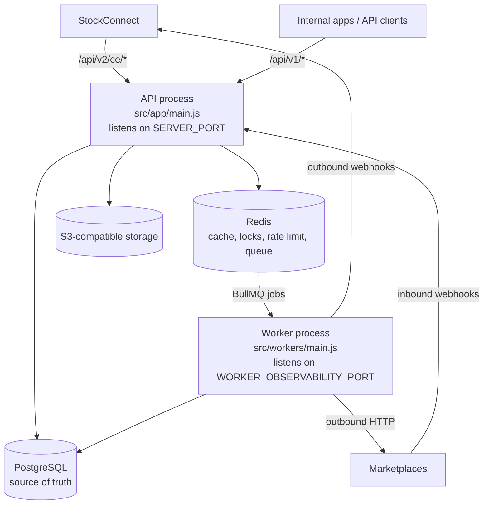
```mermaid
flowchart TB
  SC["StockConnect"]
  UI["Internal apps / API clients"]
  MP["Marketplaces"]

  API["API process<br/>src/app/main.js<br/>listens on SERVER_PORT"]
  WRK["Worker process<br/>src/workers/main.js<br/>listens on WORKER_OBSERVABILITY_PORT"]

  PG[("PostgreSQL<br/>source of truth")]
  RD[("Redis<br/>cache, locks, rate limit, queue")]
  S3[("S3-compatible storage")]

  SC -->|"/api/v2/ce/*"| API
  UI -->|"/api/v1/*"| API
  MP -->|"inbound webhooks"| API

  API --> PG
  API --> RD
  API --> S3
  RD -->|"BullMQ jobs"| WRK
  WRK --> PG
  WRK -->|"outbound HTTP"| MP
  WRK -->|"outbound webhooks"| SC
```

The two processes are deliberately separate. The API process must stay responsive, so anything slow, retryable, or dependent on a third party is pushed onto a queue and executed by the worker. The API process starts the outbox publisher; the worker process starts the retention cleanup and catalog reconciliation schedulers. Both connect to the same PostgreSQL and Redis instances.

### Design principles observed in the code

| Principle | How it is realised |
| --------- | ------------------ |
| PostgreSQL is authoritative | ADR-002; all durable state in Postgres, Redis never holds business truth |
| Layered modules | Every module under `src/modules/` has `domain/`, `application/`, `infrastructure/`, `presentation/`, `public/` |
| Cross-module access through contracts | Modules import each other only via `public/`; enforced by `no-cross-module-internals` |
| Provider neutrality in the core | `core-no-compatibility` and `compatibility-public-contracts-only` rules |
| Domain purity | `domain-no-infrastructure-packages` forbids Fastify, pg, ioredis, bullmq, zod inside `domain/` |
| Transactional consistency | Domain mutation and outbox event write share one transaction |
| Explicit composition | No DI container; dependencies are constructed in `create-infrastructure.js` and `create-application.js` and passed down |

---

## System architecture

### Layered structure

Nexora follows a hexagonal, layered arrangement inside each module. The direction of dependency always points inward toward the domain.

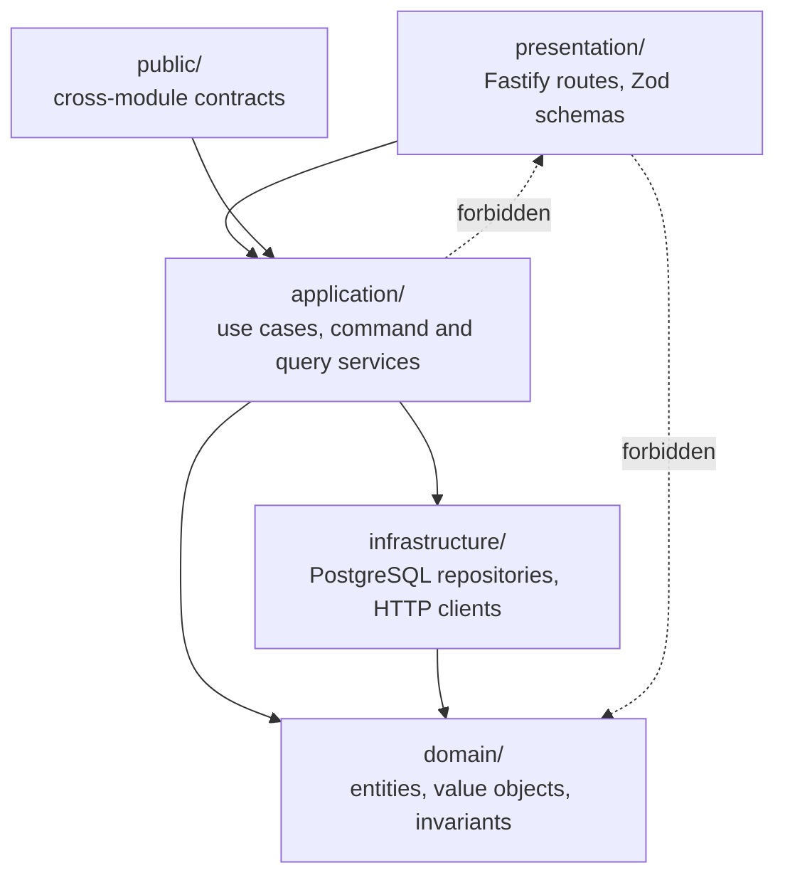
```mermaid
flowchart TD
  P["presentation/<br/>Fastify routes, Zod schemas"]
  A["application/<br/>use cases, command and query services"]
  D["domain/<br/>entities, value objects, invariants"]
  I["infrastructure/<br/>PostgreSQL repositories, HTTP clients"]
  PUB["public/<br/>cross-module contracts"]

  P --> A
  A --> D
  I --> D
  A --> I
  PUB --> A
  P -.->|forbidden| D
  A -.->|forbidden| P
```

The `domain/` layer holds business rules with no framework imports at all. The `application/` layer orchestrates: it loads aggregates through repository ports, applies domain operations, records integration events, and commits. The `infrastructure/` layer implements the ports with raw SQL through `pg`. The `presentation/` layer is thin — it validates with Zod, calls one use case, and shapes the response. The `public/` layer is the only surface other modules are allowed to import.

### Enforced architectural rules

These are not guidelines; `npm run arch:check` fails the build on violation. They are defined in `.dependency-cruiser.cjs`.

| Rule | Severity | What it prevents |
| ---- | -------- | ---------------- |
| `no-circular` | error | Circular dependencies anywhere in `src/` |
| `domain-no-infrastructure-layer` | error | Domain importing `src/infrastructure` or `src/app` |
| `domain-no-infrastructure-packages` | error | Domain importing Fastify, pg, ioredis, bullmq, AWS SDK, pino, prom-client, OpenTelemetry or zod |
| `domain-no-module-infrastructure` | error | Domain importing its own module's infrastructure or presentation |
| `application-no-presentation` | error | Application depending on presentation |
| `no-cross-module-internals` | error | A module reaching into another module's `domain/`, `infrastructure/` or `presentation/` |
| `core-no-compatibility` | error | Any non-compatibility module importing the compatibility module |
| `compatibility-no-direct-persistence` | error | The compatibility module using Postgres repositories directly |
| `compatibility-public-contracts-only` | error | The compatibility module bypassing other modules' `public/` contracts |
| `shared-stays-generic` | error | `src/shared/` depending on app, infrastructure, modules or workers |
| `infrastructure-no-modules` | error | `src/infrastructure/` depending on modules or app |
| `no-dev-dep-in-src` | error | Runtime code importing a devDependency |
| `no-orphans` | warn | Unreachable files, excluding the two process entrypoints |

The `core-no-compatibility` rule is the structural guarantee behind the claim that Nexora's domain is provider-neutral. The ChannelEngine-shaped API can be deleted without touching a single core module.

### Module dependency map

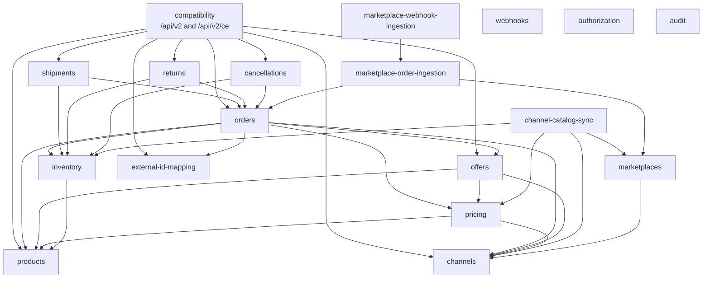
```mermaid
flowchart TD
  COMPAT["compatibility<br/>/api/v2 and /api/v2/ce"]
  ORD["orders"]
  SHP["shipments"]
  RET["returns"]
  CAN["cancellations"]
  INV["inventory"]
  PRD["products"]
  OFR["offers"]
  PRC["pricing"]
  CHN["channels"]
  MKT["marketplaces"]
  CCS["channel-catalog-sync"]
  MOI["marketplace-order-ingestion"]
  MWI["marketplace-webhook-ingestion"]
  WHK["webhooks"]
  EID["external-id-mapping"]
  AUTHZ["authorization"]
  AUD["audit"]

  COMPAT --> ORD
  COMPAT --> SHP
  COMPAT --> RET
  COMPAT --> CAN
  COMPAT --> PRD
  COMPAT --> OFR
  COMPAT --> CHN
  COMPAT --> EID

  ORD --> INV
  ORD --> PRD
  ORD --> OFR
  ORD --> PRC
  ORD --> CHN
  ORD --> EID
  SHP --> ORD
  SHP --> INV
  RET --> ORD
  RET --> INV
  CAN --> ORD
  CAN --> INV
  OFR --> PRD
  OFR --> CHN
  OFR --> PRC
  PRC --> PRD
  PRC --> CHN
  INV --> PRD

  CCS --> MKT
  CCS --> CHN
  CCS --> INV
  CCS --> PRC
  MOI --> ORD
  MOI --> MKT
  MWI --> MOI
  MKT --> CHN
```

Arrows show the direction of the import, always through a `public/` contract. Note that no arrow points *into* `compatibility` — that is the enforced rule made visible.

### Request path versus background path

The system has two distinct execution paths, and understanding which one a piece of work is on explains most of its behaviour.

**Synchronous HTTP path.** A client request is validated, authenticated, authorised, and executed inside a database transaction. The transaction writes the domain change and, in the same commit, appends an integration event row to the outbox. The response returns immediately after commit. Nothing that requires a third-party HTTP call happens here.

**Asynchronous background path.** The outbox publisher polls for unpublished events and enqueues BullMQ jobs. The worker consumes them, and only at that point does outbound HTTP occur — a catalog sync call to a marketplace, a webhook delivery to a tenant endpoint, or a marketplace lifecycle operation. Failures here are retried with backoff and never affect the original API response.

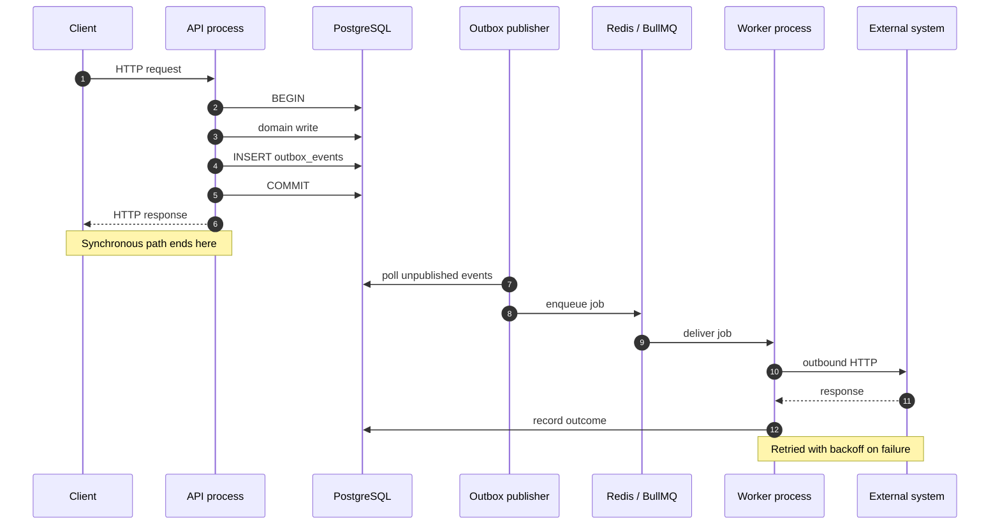
```mermaid
sequenceDiagram
  autonumber
  participant C as Client
  participant API as API process
  participant PG as PostgreSQL
  participant OB as Outbox publisher
  participant Q as Redis / BullMQ
  participant W as Worker process
  participant EXT as External system

  C->>API: HTTP request
  API->>PG: BEGIN
  API->>PG: domain write
  API->>PG: INSERT outbox_events
  API->>PG: COMMIT
  API-->>C: HTTP response
  Note over C,API: Synchronous path ends here

  OB->>PG: poll unpublished events
  OB->>Q: enqueue job
  Q->>W: deliver job
  W->>EXT: outbound HTTP
  EXT-->>W: response
  W->>PG: record outcome
  Note over W,EXT: Retried with backoff on failure
```

This is the transactional outbox pattern from ADR-005. Its value is that an event is never lost when the process crashes between the database commit and the queue publish, because the event is part of the commit.

---

## Technology stack

Only technologies actually present in `package.json` and used in `src/` are listed. Purpose and location are given for each.

### Runtime and framework

| Technology | Version constraint | Role in Nexora | Where |
| ---------- | ------------------ | -------------- | ----- |
| Node.js | `>=24.0.0` (engines) | Runtime for both processes | `package.json` |
| Fastify | `^5.2.0` | HTTP server, plugin system, lifecycle hooks | `src/app/http/create-server.js` |
| `fastify-plugin` | `^5.0.1` | Registers plugins on the root instance so hooks apply globally | Auth, logging, metrics plugins |
| JavaScript (ESM) | `"type": "module"` | Entire codebase; no TypeScript build step | Throughout |

Nexora is plain ESM JavaScript. There is no transpilation: `npm run build` runs `node --check` over every file as a syntax gate, nothing more.

### Validation and API documentation

| Technology | Role | Where |
| ---------- | ---- | ----- |
| Zod `^3.24.1` | Every request and response schema; also configuration validation | `presentation/*.schemas.js`, `src/app/config/schema.js` |
| `fastify-type-provider-zod` `^4.0.2` | Binds Zod schemas to Fastify's validator and serializer compilers | `create-server.js` |
| `@fastify/swagger` `^9.4.0` | Generates the OpenAPI 3.1 document from those same Zod schemas | `create-server.js` |
| `@scalar/fastify-api-reference` `^1.25.116` | Serves the interactive API reference UI at `/docs` | `create-server.js` |

This chain matters: because the OpenAPI document is generated from the Zod schemas that Fastify actually enforces at runtime, the documentation cannot drift from validation. A schema change updates both simultaneously.

### Data and messaging

| Technology | Role | Where |
| ---------- | ---- | ----- |
| PostgreSQL via `pg` `^8.13.1` | Source of truth; raw SQL in repositories, no ORM (ADR-011) | `src/infrastructure/postgres/` |
| Redis via `ioredis` `^5.4.1` | Cache, distributed lock, GCRA rate limiter, BullMQ transport | `src/infrastructure/redis/` |
| BullMQ `^5.34.0` | Four job queues with retry and backoff | `src/infrastructure/queue/` |
| `@aws-sdk/client-s3` `^3.700.0` | S3-compatible object storage provider | `src/infrastructure/storage/` |

Object storage is wired at bootstrap and health-checked by the API readiness probe, but no domain module currently writes objects through it. It is infrastructure-ready rather than in use.

### Security

| Technology | Role | Where |
| ---------- | ---- | ----- |
| `argon2` `^0.45.1` | Argon2id password hashing | `src/infrastructure/auth/argon2-password-hasher.js` |
| `jose` `^6.2.12` | JWT signing and verification, HS256 or RS256 | `src/infrastructure/auth/jose-access-token-service.js` |
| `otplib` `^13.5.0` | TOTP enrolment and verification for MFA step-up | `src/modules/mfa/` |
| `@fastify/helmet` `^12.0.1` | Security response headers; CSP explicitly disabled | `create-server.js` |
| `@fastify/cors` `^10.0.1` | CORS, enabled only when an origin allowlist is configured | `create-server.js` |
| Node `crypto` | SHA-256 token hashing, AES-256-GCM secret encryption, HMAC webhook signing | `src/shared/security/` |

### Observability

| Technology | Role | Where |
| ---------- | ---- | ----- |
| `pino` `^9.5.0` | Structured JSON logging with redaction and request-context enrichment | `src/infrastructure/observability/pino-logger.js` |
| `prom-client` `^15.1.3` | Prometheus metrics, including Node default metrics | `src/infrastructure/observability/prometheus-metrics.js` |
| OpenTelemetry SDK `^0.57.0` | Distributed tracing with HTTP, `pg` and `ioredis` instrumentation | `src/infrastructure/observability/tracing.js` |

### Development and quality tooling

| Technology | Role |
| ---------- | ---- |
| Vitest `^3.2.7` | Unit and integration test runner, two named projects |
| ESLint `^9.17.0` | Linting, including a rule restricting direct `process` access outside configuration and entrypoints |
| `dependency-cruiser` `^16.8.0` | Enforces the architectural boundary rules listed earlier |
| Prettier `^3.4.2` | Formatting; not part of the `verify` gate |
| `dotenv` `^18.0.1` | Loads `.env` in integration tests and tooling scripts only |

### Technologies deliberately absent

Documenting absences prevents wrong assumptions.

| Not present | Consequence |
| ----------- | ----------- |
| No ORM | All persistence is hand-written SQL in repository classes |
| No TypeScript | Type safety comes from Zod at boundaries, not from compilation |
| No ChannelEngine SDK or client | Nexora never calls ChannelEngine; see the compatibility chapter |
| No GraphQL | The API is REST-style JSON over HTTP |
| No CI workflow in the repository | `.github/workflows/` does not exist; quality gates are run manually or by external tooling |

---

## Repository structure

### Top level

| Path | Contents |
| ---- | -------- |
| `src/app/` | Process bootstrap, configuration, HTTP server, plugins, operational routes, readiness |
| `src/modules/` | Twenty business modules, each layered |
| `src/infrastructure/` | Technology adapters: Postgres, Redis, queue, storage, HTTP client, observability, auth primitives |
| `src/shared/` | Cross-cutting utilities with no dependency on modules or infrastructure |
| `src/workers/` | Worker process entrypoint, job handlers, worker bootstrap wiring, worker observability server |
| `tests/unit/` | 136 test files, no external dependencies |
| `tests/integration/` | 73 test files, requiring PostgreSQL, Redis and MinIO |
| `docs/` | Architecture notes, ADRs, operations runbooks, API inventories, this document |
| `scripts/` | Documentation and maintenance tooling |
| `infrastructure/` | Local observability stack configuration for Docker Compose |

The source tree contains 826 JavaScript files under `src/`.

### Application shell — `src/app/`

| Path | Responsibility |
| ---- | -------------- |
| `main.js` | API process entrypoint: config, infrastructure, application, listen, signal handlers |
| `bootstrap/create-infrastructure.js` | Constructs logger, metrics, tracing, Postgres pool, migrations, Redis, queue, storage, outbox, idempotency |
| `bootstrap/create-application.js` | Constructs every module, wires use cases, registers readiness probes, builds the HTTP server |
| `bootstrap/shutdown.js` | Ordered graceful shutdown with a global deadline |
| `bootstrap/migrate-cli.js` | Standalone `up` and `status` migration commands |
| `bootstrap/external-id-backfill-cli.js` | Backfills compatibility integer identifiers for existing rows |
| `config/schema.js` | Zod schema for every recognised environment variable |
| `config/config.js` | Maps validated environment into the nested `AppConfig` and applies cross-field consistency checks |
| `http/create-server.js` | Fastify construction and the full plugin and route registration order |
| `http/plugins/` | `request-context`, `logging`, `metrics`, `error-handler`, `authentication` |
| `http/routes/` | `health.routes.js`, `metrics.routes.js`, `foundation.routes.js` |
| `observability/readiness.js` | The readiness service and the default and worker probe sets |
| `errors/` | `error-mapper.js` and `error-envelope.js` — normalisation and response shaping |

### Modules — `src/modules/`

| Module | Concern |
| ------ | ------- |
| `identity` | Login, refresh rotation, logout, access-token authentication |
| `authorization` | Roles, permissions, memberships, effective permission resolution |
| `api-keys` | API key issuance, rotation, revocation, verification |
| `mfa` | TOTP enrolment, step-up verification, recovery codes |
| `tenants` | Tenant lifecycle and slug rules |
| `audit` | Append-only audit log and its query API |
| `products` | Product catalogue and localised content |
| `offers` | Product-to-channel listings |
| `pricing` | Prices with currency and validity windows |
| `inventory` | Stock locations, balances, reservations, movements |
| `orders` | Order capture, status machine, fulfilment coordination |
| `shipments` | Shipment documents and inventory consumption |
| `returns` | Return requests, approval, receipt, restock |
| `cancellations` | Line cancellation and reservation release |
| `channels` | Sales channels and their marketplace connections |
| `marketplaces` | Marketplace registry and all provider adapters |
| `channel-catalog-sync` | Outbound product, offer, price and inventory synchronisation |
| `marketplace-order-ingestion` | Inbound order ingestion and lifecycle processing |
| `marketplace-webhook-ingestion` | Inbound marketplace webhook receipt and dispatch |
| `webhooks` | Outbound tenant webhook subscriptions and delivery |
| `external-id-mapping` | Stable integer identifiers for compatibility consumers |
| `compatibility` | The ChannelEngine-shaped `/api/v2` and `/api/v2/ce` surfaces |

### Shared utilities — `src/shared/`

| Path | Purpose |
| ---- | ------- |
| `context/request-context.js` | AsyncLocalStorage request scope carrying request id, tenant, principal, trace id |
| `idempotency/` | Idempotency key requirement, stable SHA-256 fingerprinting, service port |
| `errors/` | `AppError` hierarchy, error code registry, log-safe error inspection |
| `events/` | Integration event catalogue, event recorder port, external delivery allowlist |
| `money/` | ISO 4217 currency parsing and integer minor-unit amounts |
| `pagination/` | Cursor encoding and clamped page limits |
| `rate-limit/`, `auth/rate-limit-policies.js` | Rate limiter port and the named policies |
| `auth/merchant-compat-route-prefix.js` | Identifies `/api/v2/ce` paths for the CE credential reader |
| `auth/read-merchant-compat-query-api-key.js` | Reads `apiKey`, `apikey` query values and the `X-CE-KEY` header |
| `security/` | SSRF validator, outbound HTTPS validation, password policy, crypto helpers |
| `logging/redaction.js` | Pino redaction paths and deep redaction for arbitrary payloads |
| `stockconnect/` | StockConnect CE webhook subscription constants |

---

## Application lifecycle

### API process startup

The sequence in `src/app/main.js` is strictly ordered; each step depends on the previous one.

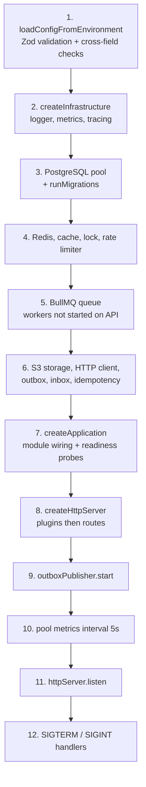
```mermaid
flowchart TD
  A["1. loadConfigFromEnvironment<br/>Zod validation + cross-field checks"]
  B["2. createInfrastructure<br/>logger, metrics, tracing"]
  C["3. PostgreSQL pool<br/>+ runMigrations"]
  D["4. Redis, cache, lock, rate limiter"]
  E["5. BullMQ queue<br/>workers not started on API"]
  F["6. S3 storage, HTTP client,<br/>outbox, inbox, idempotency"]
  G["7. createApplication<br/>module wiring + readiness probes"]
  H["8. createHttpServer<br/>plugins then routes"]
  I["9. outboxPublisher.start"]
  J["10. pool metrics interval 5s"]
  K["11. httpServer.listen"]
  L["12. SIGTERM / SIGINT handlers"]

  A --> B --> C --> D --> E --> F --> G --> H --> I --> J --> K --> L
```

Two details deserve emphasis. First, **migrations run automatically at infrastructure boot**. If `DATABASE_MIGRATION_URL` is set and differs from `DATABASE_URL`, migrations execute against the migration URL on a separate pool while the runtime pool uses the ordinary connection string — this is what allows the runtime role to be a restricted, RLS-bound role. Second, the **outbox publisher runs only on the API process**; the worker does not start it.

### Worker process startup

`src/workers/main.js` shares steps one and two with the API but diverges after that. It passes `processKind: 'worker'` into `createInfrastructure`, which changes the OpenTelemetry service name to `WORKER_OTEL_SERVICE_NAME` or `{OTEL_SERVICE_NAME}-worker`. It then registers job handlers on the worker runtime, builds a worker-specific readiness service, optionally starts the observability HTTP server, and starts the retention cleanup and catalog reconciliation schedulers.

| Concern | API process | Worker process |
| ------- | ----------- | -------------- |
| HTTP server on `SERVER_PORT` | Yes | No |
| Observability HTTP on `WORKER_OBSERVABILITY_PORT` | No | Yes, when enabled |
| BullMQ workers consuming jobs | No | Yes |
| Outbox publisher | Yes | No |
| Retention cleanup scheduler | No | Yes |
| Catalog sync reconciliation scheduler | No | Yes |
| Readiness probe set | postgres, redis, queue, storage, CE compatibility | postgres, redis, queue, workers_registered |

The storage probe exists only on the API side; the worker instead asserts that job handlers are registered.

### Graceful shutdown

`src/app/bootstrap/shutdown.js` implements a single ordered routine used by both processes, bounded by `SERVER_SHUTDOWN_TIMEOUT_MS` (default 15000). Each step is wrapped so a failure is logged as a warning and does not abort the remaining steps, and each is raced against the time remaining until the global deadline.

1. Log shutdown start.
2. `readiness.markNotReady()` — readiness immediately reports failure so load balancers stop routing traffic.
3. Close the API HTTP server, if present.
4. Close the worker observability HTTP server, if present.
5. Stop the outbox publisher (API).
6. Stop the retention cleanup scheduler (worker).
7. Stop the catalog sync reconciliation scheduler (worker).
8. Close the worker runtime, draining in-flight jobs (worker).
9. Close the queue.
10. Close Redis.
11. Close the database pool.
12. Shut down tracing.
13. Flush the logger.

The order is the reverse of acquisition, with one deliberate exception: readiness is marked unhealthy *first*, before anything is torn down, so that in-flight requests can complete while new ones are routed elsewhere.

One asymmetry is worth noting. The worker's `/health/live` returns 503 with `{ status: 'shutting_down' }` once shutdown begins, whereas the API's `/health/live` always returns `{ status: 'ok' }` and is unaware of the shutdown flag. Orchestrators relying on API liveness to detect draining will not see it there; they should use `/health/ready`, which does reflect it.

### Request lifecycle

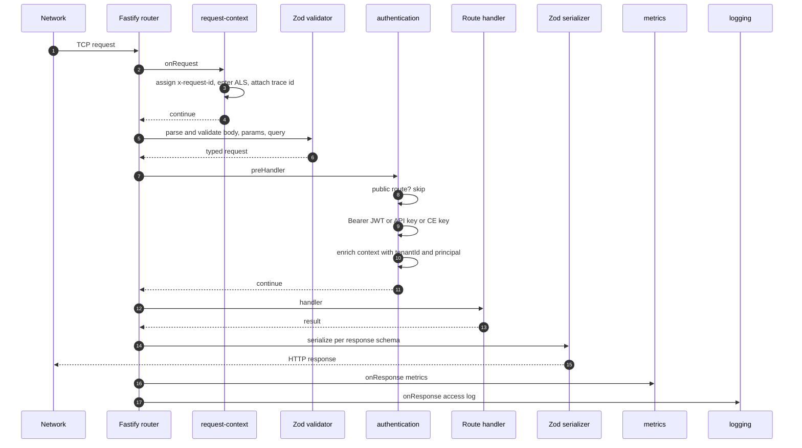
```mermaid
sequenceDiagram
  autonumber
  participant N as Network
  participant F as Fastify router
  participant RC as request-context
  participant V as Zod validator
  participant AU as authentication
  participant H as Route handler
  participant S as Zod serializer
  participant M as metrics
  participant L as logging

  N->>F: TCP request
  F->>RC: onRequest
  RC->>RC: assign x-request-id, enter ALS, attach trace id
  RC-->>F: continue
  F->>V: parse and validate body, params, query
  V-->>F: typed request
  F->>AU: preHandler
  AU->>AU: public route? skip
  AU->>AU: Bearer JWT or API key or CE key
  AU->>AU: enrich context with tenantId and principal
  AU-->>F: continue
  F->>H: handler
  H-->>F: result
  F->>S: serialize per response schema
  S-->>N: HTTP response
  F->>M: onResponse metrics
  F->>L: onResponse access log
```

Because the authentication plugin is registered with `fastify-plugin`, its `preHandler` hook is attached to the **root instance** and therefore applies to every route, including routes registered earlier in the file. Registration order controls which routes exist, not which are protected; protection is controlled by the public-route allowlist inside the plugin.

### Plugin and route registration order

| Order | Component | Mechanism | Purpose |
| ----: | --------- | --------- | ------- |
| 1 | `@fastify/helmet` | middleware | Security headers, CSP disabled |
| 2 | `@fastify/cors` | middleware | Only when `SERVER_CORS_ORIGINS` is non-empty |
| 3 | `request-context` | `onRequest` | Request id, AsyncLocalStorage, trace id |
| 4 | `logging` | `onResponse` | Structured access log |
| 5 | `metrics` | `onResponse` | HTTP counter and histogram, when metrics enabled |
| 6 | `error-handler` | `setErrorHandler` | Error normalisation and envelope |
| 7 | `@fastify/swagger` | spec generation | OpenAPI 3.1 from Zod |
| 8 | Scalar and doc routes | routes | `/docs`, `/openapi.json`, `/api-docs`, `/api-docs.json` when `DOCS_ENABLED` |
| 9 | health routes | routes | `/health/live`, `/health/ready` |
| 10 | metrics routes | routes | `/internal/metrics` |
| 11 | foundation routes | routes | `/api/v1/foundation/*` |
| 12 | tenants routes | routes | Tenant bootstrap, partly public |
| 13 | identity auth routes | routes | Login, refresh, logout |
| 14 | marketplace webhook ingestion | routes | Inbound marketplace webhooks |
| 15 | **authentication** | `preHandler` (global) | JWT, API key, CE key resolution |
| 16+ | authorization, audit, api-keys, mfa, marketplaces, channels, products, pricing, offers, inventory, orders, shipments, returns, cancellations, webhooks, compatibility | routes | The protected surface |

### Readiness probes

| Probe | Checks | API | Worker |
| ----- | ------ | --- | ------ |
| `postgres` | `database.healthCheck()` | Yes | Yes |
| `redis` | `redis.healthCheck()` | Yes | Yes |
| `queue` | `queue.healthCheck()` | Yes | Yes |
| `storage` | `storage.healthCheck()` | Yes | No |
| `workers_registered` | Job handlers registered on the runtime | No | Yes |
| `external_compat_ce_routes` | CE handler dependencies wired | Yes | No |
| `stockconnect_ce_compat` | Same check under the legacy name | Yes | No |

The two compatibility probes are **synchronous wiring assertions**, not connectivity checks. They confirm that `stockConnectCeOrderCompatibilityQuery`, `stockConnectCeCatalogCommand`, `stockConnectCeOrderInvoiceQuery` and `stockConnectCeChannelCompatibilityQuery` are present on the route dependencies. They make no outbound HTTP call and say nothing about StockConnect's own availability.

When `markNotReady()` has been called, `evaluate()` short-circuits to `{ ready: false, checks: { process: 'failed' } }` without running any dependency probe.

---

## Functional modules

Each module below is described by what it is for, what it owns, and where its limits are. Endpoint lists are complete for the module; full request and response schemas live in the generated OpenAPI document and are not duplicated here.

### Identity

**Purpose.** Authenticate a user into a tenant and issue short-lived access tokens with rotating refresh tokens.

**Login** (`src/modules/identity/application/use-cases/login.js`) resolves the tenant by slug, requires tenant status `ACTIVE`, normalises the email through the `Email` value object, verifies the password with Argon2id, and requires an active membership that grants access. On success it creates a refresh session, signs a JWT, and writes a `LOGIN_SUCCESS` audit entry. Failures write `LOGIN_FAILURE` and return a generic `InvalidCredentialsError` so the caller cannot distinguish a wrong password from a missing user.

**Refresh rotation** is the most security-sensitive part of the module. The refresh token is hashed with SHA-256 before lookup, so the raw token is never stored. `evaluateRefreshSession` in `domain/refresh-rotation.js` classifies the presented token. If a session that was already `REPLACED` or `REVOKED` is presented again, this is treated as **token family reuse**: the entire `familyId` is revoked, a `REFRESH_REUSE_DETECTED` audit entry is written, and the caller receives invalid credentials. A normal rotation creates a new session in the same family and marks the old one replaced.

**Access-token authentication** (`application/authenticate-access-token.js`) verifies the JWT, loads the refresh session and requires it to be `ACTIVE` and unexpired, loads the user, and resolves effective permissions through the authorization module. A user with **zero** effective permissions is rejected with an authentication error rather than being admitted with an empty permission set.

**Endpoints.** `POST /api/v1/auth/login`, `POST /api/v1/auth/refresh`, `POST /api/v1/auth/logout`, `GET /api/v1/auth/me`. The first three are public; `me` requires a bearer token.

**Limitation.** Login does not enforce MFA even when a user has an active TOTP factor. MFA in Nexora gates *step-up* operations, not initial sign-in.

### Authorization

**Purpose.** Decide what an authenticated principal may do inside a tenant.

The model is: a global `permissions` catalogue, tenant-scoped `roles`, a `role_permissions` join, and `membership_roles` linking a tenant membership to roles. Effective permissions (`domain/effective-permissions.js`) are the sorted union of permission keys from **active** roles on an **active** membership.

There is an important asymmetry between seeding and checking. Seeding system roles uses **pattern matching** — `all`, `exact`, `prefix` and `suffix` patterns in `domain/permission-pattern.js` — to expand a role template into concrete permission keys. Runtime checks in `application/authorization-service.js` are **exact string comparison** only. Wildcards never apply at request time.

There is no global authorization Fastify plugin. Each route handler obtains the actor context and calls `requirePermission` with a literal permission string. This makes authorization explicit and greppable at the cost of being easy to omit in a new handler.

The **last-admin guard** (`application/last-admin-guard.js`) prevents removing a role granting `tenant.admin` when that would leave the tenant with no admin-capable membership, using `SELECT ... FOR UPDATE` to make the check race-free.

**Endpoints.** `GET/POST /api/v1/roles`, `GET /api/v1/permissions`, `GET/POST /api/v1/memberships/:membershipId/roles`, `DELETE /api/v1/memberships/:membershipId/roles/:roleId`.

### API keys

**Purpose.** Machine-to-machine credentials scoped to a tenant, used heavily by the compatibility surfaces.

A key has the wire format `prefix.secret`, where the prefix is `nxk_` plus eight alphanumeric characters and the secret is 32 random bytes encoded base64url. Only the **SHA-256 hash** of the secret is stored, alongside a globally unique prefix used for lookup. Verification hashes the presented secret and compares with a timing-safe comparison.

A key's scopes are intersected with the creating actor's own permissions at creation time, so a key can never be more privileged than the person who created it. At verification the principal's permissions are the stored scopes; live role membership is not re-resolved, which means revoking a user's role does not retroactively narrow a key they issued.

Rotation requires both the `api_keys.manage` permission **and** a valid MFA step-up session, and preserves the prefix while replacing the secret. Revocation requires the permission but not step-up.

**Endpoints.** `GET/POST /api/v1/api-keys`, `POST /api/v1/api-keys/:apiKeyId/rotate`, `POST /api/v1/api-keys/:apiKeyId/revoke`.

### MFA

**Purpose.** Provide step-up assurance for sensitive operations.

TOTP secrets are generated with `otplib` and stored **encrypted with AES-256-GCM** using a key derived from `AUTH_MFA_ENCRYPTION_KEY`, which configuration validation requires to be exactly 32 bytes. Enrolment is a three-step flow — start, verify, activate — and activation issues recovery codes stored as SHA-256 hashes for one-time use.

A successful `POST /api/v1/mfa/verify` records a row in `step_up_sessions` valid for `AUTH_STEP_UP_TTL_SECONDS`. Operations such as API key rotation and webhook secret rotation check for that row.

**Endpoints.** `POST /api/v1/mfa/totp/start`, `/totp/verify`, `/totp/activate`, `POST /api/v1/mfa/verify`, `POST /api/v1/mfa/recovery-code/use`.

### Tenants

**Purpose.** The tenancy root. Every tenant-scoped table keys off `tenants.id`.

Slugs are normalised to lowercase and must match `^[a-z0-9](?:[a-z0-9-]{0,61}[a-z0-9])?$`, enforced both in application code and by a database CHECK constraint. Status is `ACTIVE`, `SUSPENDED` or `CLOSED`; only `ACTIVE` tenants can authenticate.

Tenant isolation is enforced on two levels. The application calls `database.execute(..., { tenantId })`, which issues `set_config('app.tenant_id', <uuid>, true)` for the transaction. PostgreSQL row-level security policies then restrict rows to `tenant_id = app.current_tenant_id()`.

**Endpoints.** `POST /api/v1/tenants` and `GET /api/v1/tenants/:tenantId` are public by design (bootstrap and lookup); `suspend`, `reactivate` and `close` are protected.

### Audit

**Purpose.** An append-only record of security-relevant and commerce-relevant actions.

Rows carry actor kind (`user`, `api-key`, `system`), actor id, event type, resource type and id, a JSONB metadata blob, IP address, request id and timestamp. Metadata passes through `redactAuditMetadata` before storage so tokens and secrets are not persisted. `AUDIT_EVENT_TYPES` in `domain/audit-event.js` enumerates 59 canonical event types.

**Endpoint.** `GET /api/v1/audit`, requiring `audit.read`, filterable by event type with a limit between 1 and 200.

### Products

**Purpose.** The tenant catalogue.

A product carries `merchantSku` (unique per tenant, maximum 128 characters, trimmed but case-preserving), an optional `externalReference`, a product type and a status of `ACTIVE`, `INACTIVE` or `ARCHIVED`. Archiving is terminal: an archived product cannot be updated. Localised merchandising data lives separately in `product_content` keyed by locale, so adding a language does not touch the product row.

**Endpoints.** `GET/POST /api/v1/products`, `GET/PATCH /api/v1/products/:productId`, `POST .../deactivate`, `POST .../archive`, `GET .../content`, `PUT .../content/:locale`.

**Events.** `product.created`, `product.updated`, `product.status_changed`.

### Offers

**Purpose.** The product-to-channel relationship. An offer is what makes a product sellable on a specific channel.

An offer is unique per tenant, product and channel. It holds the channel-side `externalReference`, a `priceReference`, an offer status of `DRAFT`, `ACTIVE`, `INACTIVE` or `SUSPENDED`, and a separate listing status. Activation can be configured to require that an effective price exists for the channel and currency, which prevents publishing an unpriced listing.

The offer's `externalReference` is the hinge for outbound synchronisation: catalog sync will skip an offer whose external reference is empty, because there is nothing on the marketplace side to update.

**Endpoints.** `GET/POST /api/v1/offers`, `GET/PATCH /api/v1/offers/:offerId`, `POST /api/v1/offers/:offerId/activate`.

### Pricing

**Purpose.** Currency-correct prices with time validity.

A price row is `(product, optional channel, currency, amountMinor, validFrom, validTo, status)`. Amounts are integer minor units — there is no floating-point money anywhere in the domain. `validTo` must be strictly after `validFrom`, and inactive prices are immutable.

`getEffectivePrice` resolves the price applicable to a product on a channel at an instant. A channel-specific price takes precedence over a tenant-wide price, and among candidates the latest `validFrom` wins. Order creation and price synchronisation both call this single method, so an order and a marketplace listing cannot disagree about which price rule applied.

**Endpoints.** `GET/POST /api/v1/prices`, `GET/PATCH /api/v1/prices/:priceId`.

### Inventory

**Purpose.** Authoritative stock, per product, per stock location.

The balance model has three fields with a hard invariant: `available = on_hand − reserved`, all non-negative, and `reserved ≤ on_hand`. Every operation both mutates the balance under a `SELECT ... FOR UPDATE` row lock and appends an immutable row to `inventory_movements`.

| Operation | `on_hand` | `reserved` | `available` | Movement type |
| --------- | --------- | ---------- | ----------- | ------------- |
| Reserve | — | increase | decrease | `RESERVATION` |
| Release | — | decrease | increase | — |
| Receive | increase | — | increase | `RECEIPT` |
| Adjust positive | increase | — | increase | `ADJUSTMENT` |
| Adjust negative | decrease | — | decrease | `ADJUSTMENT` |
| Fulfil reserved on ship | decrease | decrease | — | `SALE` |
| Record sale, no reservation | decrease | — | decrease | `SALE` |
| Record return | increase | — | increase | `RETURN` |

The distinction between the last three rows matters operationally. A normal order reserves at creation and converts reservation to sale when the shipment ships, leaving `available` unchanged at that moment because it was already reduced at reservation. A **channel-fulfilled** order — where the marketplace shipped the goods itself — never reserved, so shipping records a direct sale and `available` drops then.

**Endpoints.** `GET /api/v1/inventory`, `GET /api/v1/inventory/:productId`, `POST /api/v1/inventory/adjustments`, `/receipts`, `/reservations`, `/releases`, plus `GET/POST /api/v1/stock-locations` and `GET /api/v1/stock-locations/:stockLocationId`.

**Limitations.** `TRANSFER_IN` and `TRANSFER_OUT` movement types exist in the enum but no endpoint or use case creates them. The release endpoint reuses the `inventory.reserve` permission rather than a distinct one.

### Orders

**Purpose.** Order capture and fulfilment coordination — the busiest module in the system.

An order holds monetary totals in minor units, a tenant-unique `orderNumber` generated from `tenant_order_sequences`, an optional `externalOrderReference` for channel-originated orders, a customer snapshot, and lines. Each line tracks `cancelledQuantity`, `shippedQuantity` and `returnedQuantity`, from which the derived `cancellableQuantity`, `shippableQuantity` and `returnableQuantity` are computed. These derivations are why a partially shipped, partially cancelled order behaves correctly without extra bookkeeping.

There are four ways an order enters the system, and they differ in starting status:

| Entry point | Starting status | Reserves stock |
| ----------- | --------------- | -------------- |
| `POST /api/v1/orders` (native) | `CONFIRMED` | Yes |
| `POST /api/v2/orders` (channel ingest) | `NEW` | Yes |
| `POST /api/v2/orders/channel-fulfilled` | `NEW` | No — marketplace already shipped |
| Marketplace ingestion, polling or lifecycle | `NEW` | Yes |

**Endpoints.** `GET/POST /api/v1/orders`, `GET /api/v1/orders/:orderId`, `POST /api/v1/orders/:orderId/confirm`. Channel creation and acknowledgement are exposed through `OrderCommandService` and the `/api/v2` routes rather than as native REST.

### Shipments

**Purpose.** Represent a physical dispatch and trigger inventory consumption.

Statuses are `CREATED`, `READY_TO_SHIP`, `SHIPPED`, `IN_TRANSIT`, `DELIVERED`, `FAILED`, `CANCELLED`, with transitions asserted in `domain/shipment-status.js`. Creating a shipment validates each line against the order line's `shippableQuantity`. Shipping calls `fulfillInventoryWhenShipmentShipped`, which selects between `fulfillReservedForShipment` and `recordSale` based on the order's inventory consumption mode.

**Endpoints.** `POST /api/v1/orders/:orderId/shipments`, `GET /api/v1/shipments`, `GET /api/v1/shipments/:shipmentId`, `POST .../ship`, `/deliver`, `/cancel`.

### Returns

**Purpose.** Handle goods coming back, with an approval gate before stock is restored.

The status flow is `REQUESTED` → `APPROVED` (or `REJECTED` / `CANCELLED`) → `RECEIVED` → `COMPLETED`. Stock is restored at **receive**, not at request, and receive is refused unless the return was approved. Receiving calls `inventoryService.recordReturn` and increments the order line's returned quantity.

**Endpoints.** `POST /api/v1/orders/:orderId/returns`, `GET /api/v1/returns`, `GET /api/v1/returns/:returnId`, `POST .../approve`, `/receive`, `/complete`, `/reject`, `/cancel`.

### Cancellations

**Purpose.** Cancel order lines and release their reservations.

Unlike returns, cancellations complete synchronously: creating one releases inventory and marks the cancellation `COMPLETED` in a single transaction, emitting both `cancellation.created` and `cancellation.completed`. The `REJECTED` status exists on the entity but no HTTP path produces it.

**Endpoints.** `GET/POST /api/v1/cancellations`, `GET /api/v1/cancellations/:cancellationId`, `POST /api/v1/orders/:orderId/cancel`.

**Note.** `POST /api/v1/cancellations` requires an `Idempotency-Key`; `POST /api/v1/orders/:orderId/cancel` does not.

### Channels and marketplaces

**Channels** are tenant-scoped sales destinations. A channel references a marketplace, optionally carries a `defaultStockLocationId` — the warehouse whose availability is published to that channel — and an `externalReference`. Marketplace credentials attach to the channel through a `marketplace_connections` row with encrypted credentials.

**Marketplaces** are the global registry plus all provider adapter code. Adapters are described in their own chapter.

**Endpoints.** `GET/POST /api/v1/channels`, `GET/PATCH /api/v1/channels/:channelId`, the four `.../marketplace-connection` verbs, `POST .../marketplace-connection/test`, and `GET/POST /api/v1/marketplaces` with `GET/PATCH /api/v1/marketplaces/:id`.

### Webhooks

**Purpose.** Let a tenant subscribe to integration events and receive signed HTTP callbacks.

A subscription stores a destination URL, an encrypted secret and a list of event types validated against the catalogue's external-delivery allowlist. Delivery rows are unique per subscription and event, which is the dedupe mechanism. Delivery details are in the webhooks chapter.

**Endpoints.** `GET/POST /api/v1/webhooks`, `GET/PATCH/DELETE /api/v1/webhooks/:webhookId`, `GET .../deliveries`, `GET .../deliveries/:deliveryId`, `POST .../rotate-secret`.

### External ID mapping

**Purpose.** ChannelEngine clients expect **integer** identifiers; Nexora uses UUIDs. This module bridges the two.

The `external_integer_id_mappings` table allocates a monotonically increasing integer per tenant, provider namespace and resource type. The namespace used by the compatibility layer is `compat_v2`, and the mapped resource types are `order`, `order_line`, `return`, `shipment` and `cancellation`. Mappings are assigned when the entity is created and looked up when a compatibility response is built.

Products and channels are **not** in this table. Products are addressed by SKU, and channel integer identifiers are parsed from the channel's `externalReference` when that value happens to be numeric.

---

## API architecture

### Versioning and surfaces

| Surface | Prefix | Contract owner | Notes |
| ------- | ------ | -------------- | ----- |
| Native | `/api/v1` | Nexora | Full domain capability, UUID identifiers, `{ success, data }` envelope |
| Merchant compatibility | `/api/v2` | ChannelEngine-shaped | PascalCase fields, integer ids, `Idempotency-Key` required on mutations |
| StockConnect CE | `/api/v2/ce` | ChannelEngine-shaped | Additive to `/api/v2`, extra credential channels, optional idempotency |

ADR-010 records this strategy: `/api/v1` evolves with Nexora's own needs while `/api/v2` is a facade constrained by an external contract. The two never share request or response schemas; the compatibility layer maps between them explicitly.

### Validation and serialisation

Every route declares a Zod schema. `fastify-type-provider-zod` installs Zod as both the validator compiler and the serializer compiler, so a request that does not match is rejected before the handler runs, and a response that does not match the declared shape fails serialisation. The same schemas feed `@fastify/swagger`, which is why the OpenAPI document is always consistent with enforced behaviour.

### Success and error envelopes

Native routes return `{ success: true, data: ... }`. Errors anywhere on the native surface return a single normalised envelope produced by `src/app/errors/error-envelope.js`:

```json
{
  "success": false,
  "error": {
    "code": "VALIDATION_FAILED",
    "message": "Request validation failed",
    "details": { }
  },
  "requestId": "6f0f1e3a-..."
}
```

`details` is omitted when there is nothing safe to expose. When an error is marked non-exposable, `message` is replaced by the generic string `An unexpected error occurred` so internal details never leak. `requestId` is always present and is the value returned in the `x-request-id` response header, which makes support triage straightforward.

The compatibility surfaces use a different envelope — `{ Success, StatusCode, Message, ValidationErrors }` — because that is what ChannelEngine clients parse. This is produced by `mapCoreErrorToExternalApiResponse` and is described in the compatibility chapter.

### Error taxonomy

| Error class | HTTP | Code |
| ----------- | ---: | ---- |
| `ValidationError` | 400 | `VALIDATION_FAILED` |
| `MalformedRequestError` | 400 | `MALFORMED_REQUEST` |
| `AuthenticationError` | 401 | `AUTHENTICATION_REQUIRED` |
| `AuthorizationError` | 403 | `FORBIDDEN` |
| `NotFoundError` | 404 | `NOT_FOUND` |
| `ConflictError` | 409 | `CONFLICT` |
| `IdempotencyConflictError` | 409 | `IDEMPOTENCY_CONFLICT` |
| `IdempotentRequestInProgressError` | 409 | `IDEMPOTENT_REQUEST_IN_PROGRESS` |
| `BusinessRuleError` | 422 | `BUSINESS_RULE_VIOLATION` |
| `RateLimitError` | 429 | `RATE_LIMIT_EXCEEDED` |
| `ExternalServiceError` | 502 | `EXTERNAL_SERVICE_ERROR` |
| `DatabaseError` | 503 | `DATABASE_UNAVAILABLE` |
| `CircuitOpenError` | 503 | `CIRCUIT_OPEN` |
| `ServiceUnavailableError` | 503 | `SERVICE_UNAVAILABLE` |
| `ExternalServiceTimeoutError` | 504 | `EXTERNAL_SERVICE_TIMEOUT` |
| `ConfigurationError` | 500 | `CONFIGURATION_INVALID` |
| `InternalError` | 500 | `INTERNAL_ERROR` |

`RateLimitError` additionally sets a `Retry-After` header. The registry also defines `PAYLOAD_TOO_LARGE` and `UNSUPPORTED_MEDIA_TYPE`, but no mapping currently produces them, so an oversized body surfaces as a generic internal error.

### Idempotency

Mutating endpoints on `/api/v2` require an `Idempotency-Key` header. The record is stored in `idempotency_records`, keyed by tenant, a principal fingerprint, a route identifier and the key. A stable SHA-256 fingerprint of the request body (`src/shared/idempotency/fingerprint.js`) detects the case where the same key is reused with a different payload, which returns 409.

Separately, the commerce modules implement **request equivalence**: when a create request carries a natural business key that already exists — a channel order's external reference, a shipment's `externalReference` — the handler compares the new payload against the stored aggregate. If they are equivalent the existing record is returned; if they differ, the request is rejected as a conflict. This protects against duplicate ingestion even when the caller did not send an idempotency key.

### Pagination, filtering and rate limiting

Native list endpoints use cursor pagination with limits clamped between 1 and 100 (`src/shared/pagination/cursor.js`). The compatibility surfaces use page-and-size pagination because that is what the external contract specifies — PascalCase `Page`/`PageSize` on `/api/v2` and lowercase `page`/`pageSize` on `/api/v2/ce`.

Rate limiting is implemented as a Redis GCRA algorithm in a Lua script (`src/infrastructure/redis/redis-rate-limiter.js`). There is no in-memory fallback: if Redis is unavailable, rate-limited operations fail closed. Named policies live in `src/shared/auth/rate-limit-policies.js`.

| Policy | Limit | Window |
| ------ | ----: | ------ |
| `auth.login` | 10 | 900 s |
| `auth.refresh` | 30 | 900 s |
| `catalog-sync` | 120 | 60 s |
| Compatibility read | 120 | 60 s |
| Compatibility mutation | 60 | 60 s |

Compatibility rate limits are keyed per tenant **and** per credential, using a subject of the form `<tenantId>:api-key:<id>:read`, so one noisy API key cannot exhaust another's budget.

### API documentation endpoints

When `DOCS_ENABLED` is true:

| URL | Content |
| --- | ------- |
| `/docs` | Scalar interactive API reference |
| `/api-docs` | Redirect to `/docs` |
| `/openapi.json` | OpenAPI 3.1 document |
| `/api-docs.json` | Same document under an alias path |

---

## API reference

The complete machine-readable reference is the generated OpenAPI document. This chapter gives the registered surface grouped by module, with the route identifiers used by the repository's route inventory so that any endpoint can be cross-referenced with `docs/API_ROUTE_INVENTORY.md`, `docs/SWAGGER_COVERAGE_REPORT.md` and the Postman collection.

### Surface totals

| Metric | Count |
| ------ | ----: |
| Unique registered endpoints on the API process | 147 |
| GET | 58 |
| POST | 68 |
| PUT | 9 |
| PATCH | 9 |
| DELETE | 3 |
| Worker observability endpoints (separate port) | 3 |

### Operational and documentation endpoints

| Route ID | Method | Path | Auth | Purpose |
| -------- | ------ | ---- | ---- | ------- |
| R-0144 | GET | `/health/live` | Public | Liveness; always `{ status: 'ok' }` on the API process |
| R-0145 | GET | `/health/ready` | Public | Runs all readiness probes; 503 when any fails |
| R-0146 | GET | `/internal/metrics` | Public | Prometheus exposition |
| R-0147 | GET | `/openapi.json` | Public when docs enabled | OpenAPI 3.1 document |
| R-0001 | GET | `/api-docs` | Public when docs enabled | Redirect to Scalar UI |
| R-0002 | GET | `/api-docs.json` | Public when docs enabled | OpenAPI alias |
| R-0024 | POST | `/api/v1/foundation/echo` | Public | Validated echo for connectivity testing |
| R-0025 | GET | `/api/v1/foundation/ping` | Public | Returns `pong` |

`/internal/metrics` and `/health/*` are unauthenticated by design and must not be exposed publicly at the ingress.

### Identity, tenancy and access control

| Route ID | Method | Path | Auth | Purpose |
| -------- | ------ | ---- | ---- | ------- |
| R-0008 | POST | `/api/v1/auth/login` | Public | Authenticate with tenant slug, email, password |
| R-0011 | POST | `/api/v1/auth/refresh` | Public | Rotate refresh token, issue new access token |
| R-0009 | POST | `/api/v1/auth/logout` | Public | Revoke the refresh session |
| R-0010 | GET | `/api/v1/auth/me` | Bearer | Current principal and membership status |
| R-0087 | POST | `/api/v1/tenants` | Public | Create a tenant |
| R-0088 | GET | `/api/v1/tenants/:tenantId` | Public | Read a tenant |
| R-0091 | POST | `/api/v1/tenants/:tenantId/suspend` | Protected | Suspend a tenant |
| R-0090 | POST | `/api/v1/tenants/:tenantId/reactivate` | Protected | Reactivate a tenant |
| R-0089 | POST | `/api/v1/tenants/:tenantId/close` | Protected | Close a tenant |
| R-0077 | GET | `/api/v1/roles` | Protected | List tenant roles |
| R-0078 | POST | `/api/v1/roles` | Protected | Create a role |
| R-0057 | GET | `/api/v1/permissions` | Protected | List the permission catalogue |
| R-0037 | GET | `/api/v1/memberships/:membershipId/roles` | Protected | Roles on a membership |
| R-0038 | POST | `/api/v1/memberships/:membershipId/roles` | Protected | Assign a role |
| R-0039 | DELETE | `/api/v1/memberships/:membershipId/roles/:roleId` | Protected | Remove a role, subject to the last-admin guard |
| R-0003 | GET | `/api/v1/api-keys` | Protected | List keys; requires `api_keys.read` |
| R-0004 | POST | `/api/v1/api-keys` | Protected | Create a key; secret returned once |
| R-0006 | POST | `/api/v1/api-keys/:apiKeyId/rotate` | Protected + step-up | Rotate the secret |
| R-0005 | POST | `/api/v1/api-keys/:apiKeyId/revoke` | Protected | Revoke a key |
| R-0042 | POST | `/api/v1/mfa/totp/start` | Protected | Begin TOTP enrolment |
| R-0043 | POST | `/api/v1/mfa/totp/verify` | Protected | Verify the enrolment code |
| R-0041 | POST | `/api/v1/mfa/totp/activate` | Protected | Activate the factor, issue recovery codes |
| R-0044 | POST | `/api/v1/mfa/verify` | Protected | Create a step-up session |
| R-0040 | POST | `/api/v1/mfa/recovery-code/use` | Protected | Step up with a one-time recovery code |
| R-0007 | GET | `/api/v1/audit` | Protected | Query the audit log; requires `audit.read` |

### Catalogue, pricing and inventory

| Route ID | Method | Path | Purpose |
| -------- | ------ | ---- | ------- |
| R-0062 / R-0063 | GET / POST | `/api/v1/products` | List and create products |
| R-0064 / R-0065 | GET / PATCH | `/api/v1/products/:productId` | Read and update |
| R-0069 | POST | `/api/v1/products/:productId/deactivate` | Set status `INACTIVE` |
| R-0066 | POST | `/api/v1/products/:productId/archive` | Terminal archive |
| R-0067 | GET | `/api/v1/products/:productId/content` | Localised content |
| R-0068 | PUT | `/api/v1/products/:productId/content/:locale` | Upsert one locale |
| R-0045 / R-0046 | GET / POST | `/api/v1/offers` | List and create offers |
| R-0047 / R-0048 | GET / PATCH | `/api/v1/offers/:offerId` | Read and update |
| R-0049 | POST | `/api/v1/offers/:offerId/activate` | Activate, optionally requiring an effective price |
| R-0058 / R-0059 | GET / POST | `/api/v1/prices` | List and create prices |
| R-0060 / R-0061 | GET / PATCH | `/api/v1/prices/:priceId` | Read and update |
| R-0084 / R-0085 | GET / POST | `/api/v1/stock-locations` | List and create locations |
| R-0086 | GET | `/api/v1/stock-locations/:stockLocationId` | Read a location |
| R-0027 | GET | `/api/v1/inventory` | Balances across locations |
| R-0028 | GET | `/api/v1/inventory/:productId` | Balances for one product |
| R-0029 | POST | `/api/v1/inventory/adjustments` | Signed adjustment |
| R-0030 | POST | `/api/v1/inventory/receipts` | Receive stock |
| R-0032 | POST | `/api/v1/inventory/reservations` | Reserve stock |
| R-0031 | POST | `/api/v1/inventory/releases` | Release a reservation |

### Orders, shipments, returns and cancellations

| Route ID | Method | Path | Purpose |
| -------- | ------ | ---- | ------- |
| R-0050 | GET | `/api/v1/orders` | List orders |
| R-0051 | POST | `/api/v1/orders` | Create a native order; `Idempotency-Key` required |
| R-0052 | GET | `/api/v1/orders/:orderId` | Read an order |
| R-0054 | POST | `/api/v1/orders/:orderId/confirm` | `NEW` → `CONFIRMED` |
| R-0056 | POST | `/api/v1/orders/:orderId/shipments` | Create a shipment; `Idempotency-Key` required |
| R-0079 / R-0080 | GET | `/api/v1/shipments`, `/:shipmentId` | List and read |
| R-0083 | POST | `/api/v1/shipments/:shipmentId/ship` | Ship and consume inventory |
| R-0082 | POST | `/api/v1/shipments/:shipmentId/deliver` | Mark delivered |
| R-0081 | POST | `/api/v1/shipments/:shipmentId/cancel` | Cancel and reverse quantities |
| R-0055 | POST | `/api/v1/orders/:orderId/returns` | Create a return; `Idempotency-Key` required |
| R-0070 / R-0071 | GET | `/api/v1/returns`, `/:returnId` | List and read |
| R-0072 | POST | `/api/v1/returns/:returnId/approve` | Approve |
| R-0075 | POST | `/api/v1/returns/:returnId/receive` | Receive goods and restock |
| R-0074 | POST | `/api/v1/returns/:returnId/complete` | Complete |
| R-0076 / R-0073 | POST | `/api/v1/returns/:returnId/reject`, `/cancel` | Terminal outcomes |
| R-0012 / R-0013 | GET / POST | `/api/v1/cancellations` | List and create; create requires `Idempotency-Key` |
| R-0014 | GET | `/api/v1/cancellations/:cancellationId` | Read |
| R-0053 | POST | `/api/v1/orders/:orderId/cancel` | Cancel by order; no idempotency wrapper |

### Channels, marketplaces and webhooks

| Route ID | Method | Path | Purpose |
| -------- | ------ | ---- | ------- |
| R-0015 / R-0016 | GET / POST | `/api/v1/channels` | List and create channels |
| R-0017 / R-0018 | GET / PATCH | `/api/v1/channels/:channelId` | Read and update |
| R-0022 | POST | `/api/v1/channels/:channelId/marketplace-connection` | Create the connection with encrypted credentials |
| R-0020 | GET | `.../marketplace-connection` | Read the redacted connection |
| R-0021 | PATCH | `.../marketplace-connection` | Update |
| R-0019 | DELETE | `.../marketplace-connection` | Remove |
| R-0023 | POST | `.../marketplace-connection/test` | Live credential test with sanitised errors |
| R-0033 / R-0034 | GET / POST | `/api/v1/marketplaces` | Registry list and create |
| R-0035 / R-0036 | GET / PATCH | `/api/v1/marketplaces/:id` | Read and update |
| R-0092 / R-0093 | GET / POST | `/api/v1/webhooks` | List and create subscriptions |
| R-0095 / R-0096 / R-0094 | GET / PATCH / DELETE | `/api/v1/webhooks/:webhookId` | Manage a subscription |
| R-0097 | GET | `/api/v1/webhooks/:webhookId/deliveries` | Delivery history |
| R-0098 | GET | `.../deliveries/:deliveryId` | One delivery attempt record |
| R-0099 | POST | `/api/v1/webhooks/:webhookId/rotate-secret` | Rotate the signing secret; requires step-up |
| R-0026 | POST | `/api/v1/inbound/marketplace-webhooks/:ingressToken` | Inbound marketplace webhook; authenticated by the ingress token |

### Compatibility surfaces

The `/api/v2` and `/api/v2/ce` endpoints (route identifiers R-0100 through R-0143) are documented endpoint by endpoint in the ChannelEngine compatibility chapter, because their semantics are only meaningful alongside the mapping and idempotency rules described there.

### Worker observability endpoints

These are served by the worker process on `WORKER_OBSERVABILITY_PORT`, default 3001, bound to `127.0.0.1` by default. They are **not** reachable through the API base URL.

| Method | Path | Purpose |
| ------ | ---- | ------- |
| GET | `/health/live` | Returns 503 with `{ status: 'shutting_down' }` during drain |
| GET | `/health/ready` | Worker probe set: postgres, redis, queue, workers registered |
| GET | `/internal/metrics` | Prometheus exposition for the worker process |

---

## Authentication and authorization

### Credential types

| Credential | Transport | Resolved by | Principal kind |
| ---------- | --------- | ----------- | -------------- |
| JWT access token | `Authorization: Bearer <jwt>` | `authenticateAccessToken` | `user` |
| API key | `x-api-key: <key>` or `Authorization: ApiKey <key>` | `verifyApiKey` | `api-key` |
| CE API key | Query `apiKey` or `apikey`, or header `X-CE-KEY` | `verifyApiKey`, only on `/api/v2/ce/*` | `api-key` |
| Webhook ingress token | Path segment on the inbound webhook route | Hash lookup against the connection | none — resolved to a connection |

Supplying both a bearer token and an API key on the same request is an error: the plugin raises `AuthenticationError('Provide either Bearer token or API key, not both')`.

### The public route allowlist

Authentication is skipped only for paths matching this list, taken verbatim from `src/app/http/plugins/authentication.plugin.js`:

```javascript
const PUBLIC_ROUTE_PATTERNS = [
    /^\/health\//,
    /^\/internal\/metrics$/,
    /^\/docs(?:\/|$)/,
    /^\/openapi\.json$/,
    /^\/api-docs\.json$/,
    /^\/api-docs$/,
    /^\/api\/v1\/foundation\//,
    /^\/api\/v1\/auth\/login$/,
    /^\/api\/v1\/auth\/refresh$/,
    /^\/api\/v1\/auth\/logout$/,
    /^\/api\/v1\/tenants$/,
    /^\/api\/v1\/inbound\/marketplace-webhooks\/.+$/,
];
```

Two additional cases are handled in code rather than by regex: `POST /api/v1/tenants` and any `GET /api/v1/tenants/...`.

### Authorization flow

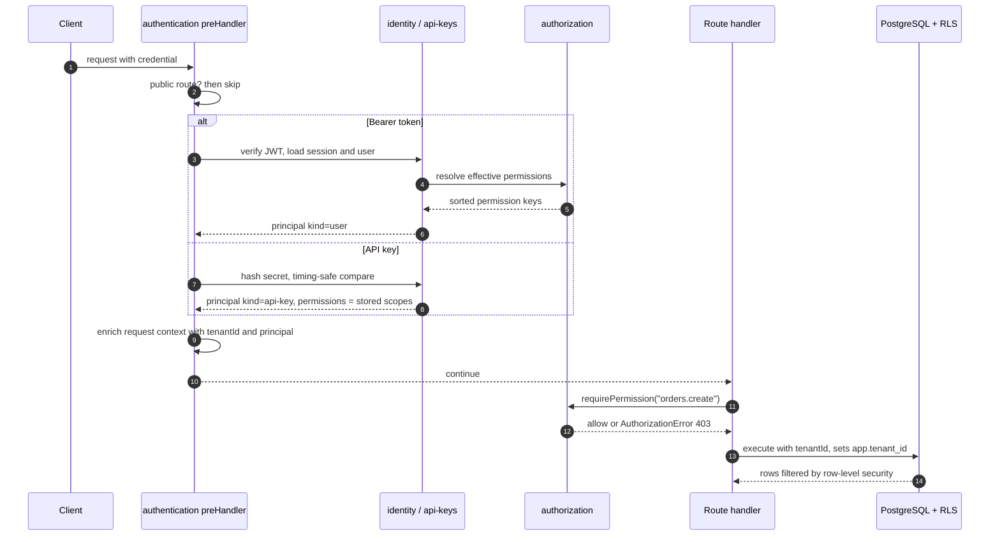
```mermaid
sequenceDiagram
  autonumber
  participant C as Client
  participant AU as authentication preHandler
  participant ID as identity / api-keys
  participant AZ as authorization
  participant H as Route handler
  participant PG as PostgreSQL + RLS

  C->>AU: request with credential
  AU->>AU: public route? then skip
  alt Bearer token
    AU->>ID: verify JWT, load session and user
    ID->>AZ: resolve effective permissions
    AZ-->>ID: sorted permission keys
    ID-->>AU: principal kind=user
  else API key
    AU->>ID: hash secret, timing-safe compare
    ID-->>AU: principal kind=api-key, permissions = stored scopes
  end
  AU->>AU: enrich request context with tenantId and principal
  AU-->>H: continue
  H->>AZ: requirePermission("orders.create")
  AZ-->>H: allow or AuthorizationError 403
  H->>PG: execute with tenantId, sets app.tenant_id
  PG-->>H: rows filtered by row-level security
```

There are two independent enforcement layers. Permission checks decide *what action* is allowed; row-level security decides *which rows* are visible. A bug in one does not automatically defeat the other.

### Secret storage

| Secret | Algorithm |
| ------ | --------- |
| User password | Argon2id, library default parameters |
| Refresh token | SHA-256 hex of the raw token |
| Password reset token | SHA-256 hex |
| MFA recovery code | SHA-256 hex |
| API key secret | SHA-256 hex, timing-safe comparison |
| MFA TOTP secret | AES-256-GCM at rest |
| Webhook secret, marketplace credentials | Encrypted ciphertext columns |
| JWT | HS256 with a shared secret, or RS256 with a key pair |

### Permission catalogue

Permission keys follow `^[a-z][a-z0-9_.]*$`. Those present in migrations and code include:

`tenant.admin`, `orders.read`, `orders.create`, `orders.update`, `orders.cancel`, `orders.ingest`, `orders.ingest_channel_fulfilled`, `products.read`, `products.create`, `products.update`, `inventory.read`, `inventory.update`, `inventory.adjust`, `inventory.reserve`, `shipments.read`, `shipments.create`, `shipments.update`, `returns.read`, `returns.create`, `returns.update`, `cancellations.read`, `cancellations.create`, `channels.read`, `channels.create`, `channels.update`, `users.read`, `users.manage`, `roles.read`, `roles.manage`, `audit.read`, `audit.export`, `api_keys.read`, `api_keys.manage`, `mfa.manage`, `auth.step_up`, `marketplaces.read`, `marketplaces.manage`, `pricing.read`, `pricing.create`, `pricing.update`, `offers.read`, `offers.create`, `offers.update`, `webhooks.read`, `webhooks.manage`.

ADR-012 defines seven seeded system roles per tenant, expanded from these keys through the pattern mechanism.

### Verified security limitations

These are stated neutrally as facts about the current code, not as vulnerabilities with assessed severity.

1. **Unscoped transactions on RLS-protected tables.** Refresh, logout and API-key verification query `refresh_sessions` and `api_keys` through `database.execute()` **without** a `tenantId`, because the tenant is not yet known. With `app.current_tenant_id()` unset, an RLS policy would deny the rows. These paths therefore depend on the connecting role bypassing RLS, which is inconsistent with the `nexora_app` restricted-role model introduced by migration `0030_rls_hardening.sql`.
2. **Hardcoded role password in a migration.** `0030_rls_hardening.sql` creates the `nexora_app` role with a literal password, documented as a Docker development convenience.
3. **Default MFA encryption key.** `AUTH_MFA_ENCRYPTION_KEY` has a default value in the configuration schema; deployments that do not override it encrypt TOTP secrets with a known key.
4. **No MFA at login.** MFA gates step-up operations only.
5. **Exact-match authorization only at runtime.** Wildcard permission patterns apply at role seeding, not at request time.
6. **API key permissions are frozen at issuance.** Scopes are stored on the key; later role changes do not narrow them.
7. **Content Security Policy disabled.** Helmet is registered with `contentSecurityPolicy: false`.
8. **Broad unauthenticated surface by design.** Tenant creation and lookup, health, metrics, documentation and marketplace webhook ingress are all public.
9. **`SECURITY DEFINER` webhook lookup.** Migration `0047` adds `app.lookup_marketplace_connection_for_webhook`, which intentionally bypasses the tenant GUC so an inbound webhook can be routed before the tenant is known.
10. **Global tables without RLS.** `users`, `permissions` and the password tables are global; access control for them is purely application-level.

---

## Database architecture

### Technology and access pattern

PostgreSQL is accessed through `pg` with hand-written SQL in repository classes. There is no ORM, a deliberate choice recorded in ADR-011. Pool behaviour, statement timeouts and query timeouts are all configurable, and every connection sets `application_name` to `nexora-backend` so sessions are identifiable in `pg_stat_activity`.

Transactions are opened by the application layer, optionally with an isolation level and read-only flag, and optionally with a tenant identifier that sets the transaction-local GUC used by row-level security.

### Migrations

Migrations are forward-only SQL files applied by a custom runner (`src/infrastructure/postgres/migrator.js`). Each file's checksum is recorded, so editing an applied migration is detected. The runner takes PostgreSQL advisory lock `8147302915` to make concurrent startups safe, and records applied versions in `schema_migrations`.

Forty-seven migrations exist, in order:

| Range | Theme |
| ----- | ----- |
| `0001`–`0004` | App schema, tenant context function, outbox, inbox, idempotency |
| `0005`–`0011` | Tenants, users, memberships, roles, permissions, authentication, API keys, MFA, audit |
| `0012`–`0017` | Marketplaces, channels, products, inventory, pricing, offers |
| `0018`–`0022` | Commerce permissions, composite foreign keys, permission backfills |
| `0023`–`0026` | Orders, shipments, cancellations, returns |
| `0027`–`0030` | Phase 4 permissions and composite keys, RLS hardening |
| `0031`–`0033` | External reference columns on shipments, cancellations, returns |
| `0034`–`0037` | Webhook subscriptions, deliveries, permissions |
| `0038`–`0041` | Order ingestion permissions and backfills |
| `0042`–`0044` | External integer id mappings, channel default stock location, delivery retention |
| `0045`–`0047` | Marketplace connections, entity mapping, webhook ingress |

### Core entity relationships

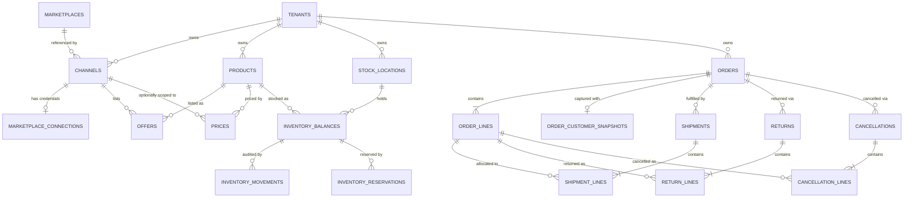
```mermaid
erDiagram
  TENANTS ||--o{ CHANNELS : owns
  TENANTS ||--o{ PRODUCTS : owns
  TENANTS ||--o{ STOCK_LOCATIONS : owns
  TENANTS ||--o{ ORDERS : owns
  MARKETPLACES ||--o{ CHANNELS : "referenced by"
  CHANNELS ||--o| MARKETPLACE_CONNECTIONS : "has credentials"
  CHANNELS ||--o{ OFFERS : lists
  PRODUCTS ||--o{ OFFERS : "listed as"
  PRODUCTS ||--o{ PRICES : "priced by"
  CHANNELS ||--o{ PRICES : "optionally scoped to"
  PRODUCTS ||--o{ INVENTORY_BALANCES : "stocked as"
  STOCK_LOCATIONS ||--o{ INVENTORY_BALANCES : holds
  INVENTORY_BALANCES ||--o{ INVENTORY_MOVEMENTS : "audited by"
  INVENTORY_BALANCES ||--o{ INVENTORY_RESERVATIONS : "reserved by"
  ORDERS ||--|{ ORDER_LINES : contains
  ORDERS ||--o| ORDER_CUSTOMER_SNAPSHOTS : "captured with"
  ORDERS ||--o{ SHIPMENTS : "fulfilled by"
  ORDERS ||--o{ RETURNS : "returned via"
  ORDERS ||--o{ CANCELLATIONS : "cancelled via"
  SHIPMENTS ||--|{ SHIPMENT_LINES : contains
  RETURNS ||--|{ RETURN_LINES : contains
  CANCELLATIONS ||--|{ CANCELLATION_LINES : contains
  ORDER_LINES ||--o{ SHIPMENT_LINES : "allocated to"
  ORDER_LINES ||--o{ RETURN_LINES : "returned as"
  ORDER_LINES ||--o{ CANCELLATION_LINES : "cancelled as"
```

### Identity and access tables

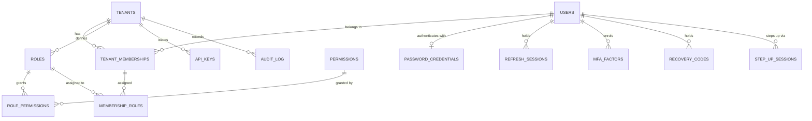
```mermaid
erDiagram
  TENANTS ||--o{ TENANT_MEMBERSHIPS : has
  USERS ||--o{ TENANT_MEMBERSHIPS : "belongs to"
  USERS ||--o| PASSWORD_CREDENTIALS : "authenticates with"
  USERS ||--o{ REFRESH_SESSIONS : "holds"
  TENANTS ||--o{ ROLES : defines
  ROLES ||--o{ ROLE_PERMISSIONS : grants
  PERMISSIONS ||--o{ ROLE_PERMISSIONS : "granted by"
  TENANT_MEMBERSHIPS ||--o{ MEMBERSHIP_ROLES : assigned
  ROLES ||--o{ MEMBERSHIP_ROLES : "assigned to"
  TENANTS ||--o{ API_KEYS : issues
  USERS ||--o{ MFA_FACTORS : enrols
  USERS ||--o{ RECOVERY_CODES : holds
  USERS ||--o{ STEP_UP_SESSIONS : "steps up via"
  TENANTS ||--o{ AUDIT_LOG : records
```

### Table inventory

| Table | Purpose | Tenant-scoped | RLS |
| ----- | ------- | ------------- | --- |
| `schema_migrations` | Applied migration ledger | No | No |
| `tenants` | Tenant registry with unique slug | — | No |
| `users` | Global user identity, unique normalised email | No | No |
| `password_credentials` | Argon2id password hashes | No | No |
| `password_reset_tokens` | Hashed reset tokens | No | No |
| `tenant_memberships` | User-to-tenant link with status | Yes | Yes |
| `permissions` | Global permission catalogue | No | No |
| `roles` | Tenant roles, system and custom | Yes | Yes |
| `role_permissions` | Role to permission grants | Yes | Yes |
| `membership_roles` | Membership to role assignment | Yes | Yes |
| `refresh_sessions` | Rotating refresh tokens with family tracking | Yes | Yes |
| `api_keys` | Hashed API key secrets and scopes | Yes | Yes |
| `mfa_factors` | AES-256-GCM encrypted TOTP secrets | Yes | Yes |
| `recovery_codes` | Hashed one-time recovery codes | Yes | Yes |
| `step_up_sessions` | Step-up assurance records | Yes | Yes |
| `audit_log` | Append-only audit trail | Nullable | Yes |
| `outbox_events` | Transactional outbox | Optional | No |
| `inbox_messages` | Consumer deduplication | No | No |
| `idempotency_records` | HTTP idempotency ledger | Optional | No |
| `marketplaces` | Global marketplace definitions | No | No |
| `channels` | Tenant sales channels | Yes | Yes |
| `marketplace_connections` | Encrypted marketplace credentials and webhook ingress token hash | Yes | Yes |
| `marketplace_entity_mappings` | Nexora entity to external entity identifiers | Yes | Yes |
| `products` | Tenant products, unique merchant SKU | Yes | Yes |
| `product_content` | Localised product content | Yes | Yes |
| `stock_locations` | Warehouses | Yes | Yes |
| `inventory_balances` | On hand, reserved, available | Yes | Yes |
| `inventory_movements` | Append-only stock ledger | Yes | Yes |
| `inventory_reservations` | Active and released reservations | Yes | Yes |
| `prices` | Minor-unit prices with validity windows | Yes | Yes |
| `offers` | Product-channel listings | Yes | Yes |
| `tenant_order_sequences` | Per-tenant order number counter | Yes | No |
| `orders` | Order header with totals and status | Yes | Yes |
| `order_lines` | Lines with cancelled, shipped, returned counters | Yes | Yes |
| `order_customer_snapshots` | Customer PII captured at order time | Yes | Yes |
| `shipments` / `shipment_lines` | Shipment documents and allocations | Yes | Yes |
| `returns` / `return_lines` | Return requests and lines | Yes | Yes |
| `cancellations` / `cancellation_lines` | Cancellations and lines | Yes | Yes |
| `webhook_subscriptions` | Destination, encrypted secret, event types | Yes | Yes |
| `webhook_deliveries` | Delivery attempts, unique per subscription and event | Yes | Yes |
| `external_integer_id_sequences` | Compatibility integer counters | Yes | No |
| `external_integer_id_mappings` | UUID to integer mapping for `compat_v2` | Yes | Yes |

### Tenant isolation mechanics

Three mechanisms work together:

1. **Transaction-local GUC.** `set_config('app.tenant_id', <uuid>, true)` scopes the setting to the transaction, so a pooled connection cannot leak a tenant context to the next checkout.
2. **Row-level security policies.** Tenant-scoped tables restrict rows to `tenant_id = app.current_tenant_id()`. The audit log additionally permits `tenant_id IS NULL` for system events.
3. **Composite foreign keys.** Migrations `0019`, `0020`, `0028` and `0046` add `(tenant_id, id)` composite keys so that a child row cannot reference a parent belonging to a different tenant, even if application code were to try.

Migration `0030_rls_hardening.sql` adds `FORCE ROW LEVEL SECURITY` and the dedicated `nexora_app` role, with the expectation that migrations run under a privileged role via `DATABASE_MIGRATION_URL` while runtime traffic uses the restricted role.

### Data retention

A scheduled cleanup running on the worker deletes aged rows in bounded batches until fewer than a full batch remain.

| Data | Environment variable | Default |
| ---- | -------------------- | ------: |
| Published outbox events | `OUTBOX_RETENTION_DAYS` | 30 |
| Processed inbox messages | `INBOX_RETENTION_DAYS` | 30 |
| Expired idempotency records | `IDEMPOTENCY_RETENTION_DAYS` | 7 |
| Terminal webhook deliveries | `WEBHOOK_DELIVERY_RETENTION_DAYS` | 30 |
| Batch size | `RETENTION_CLEANUP_BATCH_SIZE` | 100 |
| Interval | `RETENTION_CLEANUP_INTERVAL_MS` | 3600000 |

The job holds a distributed lock named `retention-cleanup`, so running several worker replicas does not cause concurrent deletion. Per-resource failures are recorded individually and exported through `nexora_retention_cleanup_*` metrics.

---

## ChannelEngine integration for StockConnect

This chapter is the core of the document. It describes what the ChannelEngine relationship actually is in this codebase, how the compatibility surface is built, how each data domain is mapped, and where the implementation is complete, partial or absent.

### What the integration actually is

StockConnect is an existing external merchant system that was written against **ChannelEngine's** API. ChannelEngine is a third-party channel-management SaaS. The business goal recorded in the planning material is to **replace ChannelEngine with Nexora** in StockConnect's architecture without rewriting StockConnect.

The technique chosen is a **compatibility facade**. Nexora implements HTTP endpoints whose paths, field names, pagination style, identifier types and error envelopes imitate ChannelEngine closely enough that StockConnect can change its base URL and credentials and keep working.

This produces a relationship that is the opposite of what the phrase "ChannelEngine integration" normally implies:

| Common assumption | Actual implementation |
| ----------------- | --------------------- |
| Nexora calls ChannelEngine's API | Nexora exposes a ChannelEngine-shaped API and StockConnect calls it |
| There is a ChannelEngine API client | There is none; no outbound HTTP to ChannelEngine exists |
| ChannelEngine credentials are configured | No `CHANNELENGINE_*` environment variables exist |
| ChannelEngine reaches the marketplaces | Nexora's own marketplace adapters do that, independently |

The evidence is direct. Searching `src/` for "ChannelEngine" returns three files, all within the compatibility module, and every occurrence is a comment or an OpenAPI description. `src/modules/compatibility/infrastructure/index.js` is an empty boundary stub — the module has no infrastructure because it makes no outbound calls. Its `domain/index.js` is likewise an empty placeholder, because the compatibility layer holds no business rules of its own; it translates and delegates.

### System context

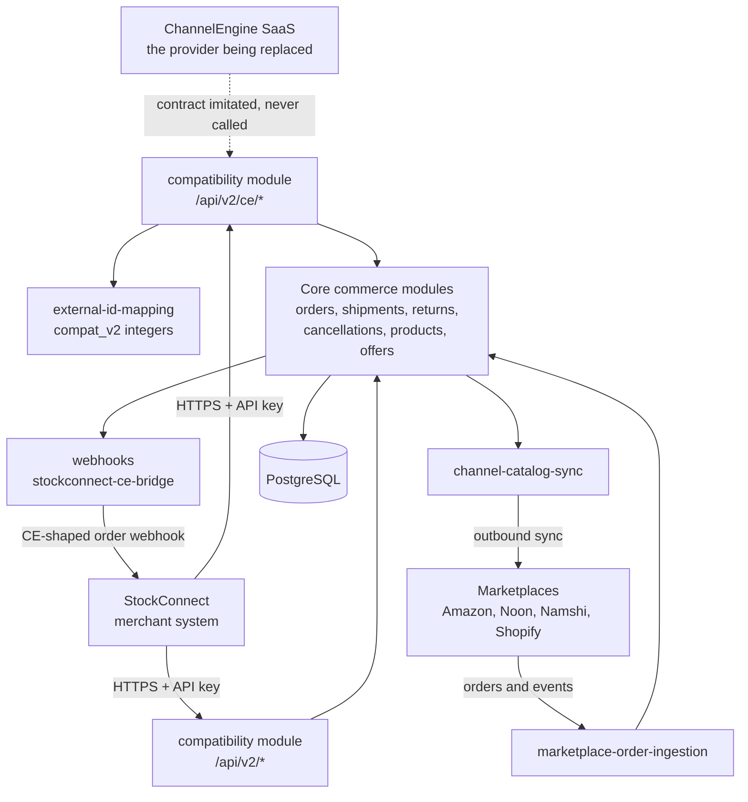
```mermaid
flowchart TB
  CEX["ChannelEngine SaaS<br/>the provider being replaced"]
  SC["StockConnect<br/>merchant system"]

  CE["compatibility module<br/>/api/v2/ce/*"]
  V2["compatibility module<br/>/api/v2/*"]
  EID["external-id-mapping<br/>compat_v2 integers"]
  CORE["Core commerce modules<br/>orders, shipments, returns,<br/>cancellations, products, offers"]
  WH["webhooks<br/>stockconnect-ce-bridge"]
  SYNC["channel-catalog-sync"]
  ING["marketplace-order-ingestion"]
  PG[("PostgreSQL")]
  MKT["Marketplaces<br/>Amazon, Noon, Namshi, Shopify"]

  CEX -. "contract imitated, never called" .-> CE
  SC -->|"HTTPS + API key"| CE
  SC -->|"HTTPS + API key"| V2
  CE --> EID
  CE --> CORE
  V2 --> CORE
  CORE --> PG
  CORE --> WH
  WH -->|"CE-shaped order webhook"| SC
  CORE --> SYNC
  SYNC -->|"outbound sync"| MKT
  MKT -->|"orders and events"| ING
  ING --> CORE
```

The dotted line is the point of the diagram: ChannelEngine is present in the picture only as the system being replaced.

### Responsibility split

| Responsibility | Owner |
| -------------- | ----- |
| Calling the compatibility API, polling for orders | StockConnect |
| Presenting a ChannelEngine-shaped contract | Nexora compatibility module |
| Authenticating the caller and enforcing tenancy | Nexora authentication plugin and RLS |
| Validating and mapping payloads | Nexora compatibility mappers |
| Executing business logic | Nexora core commerce modules |
| Allocating stable integer identifiers | Nexora external-id-mapping module |
| Reaching Amazon, Noon, Namshi, Shopify | Nexora marketplace adapters |
| Anything ChannelEngine used to do beyond these | Out of scope; not reimplemented |

### Compatibility module architecture

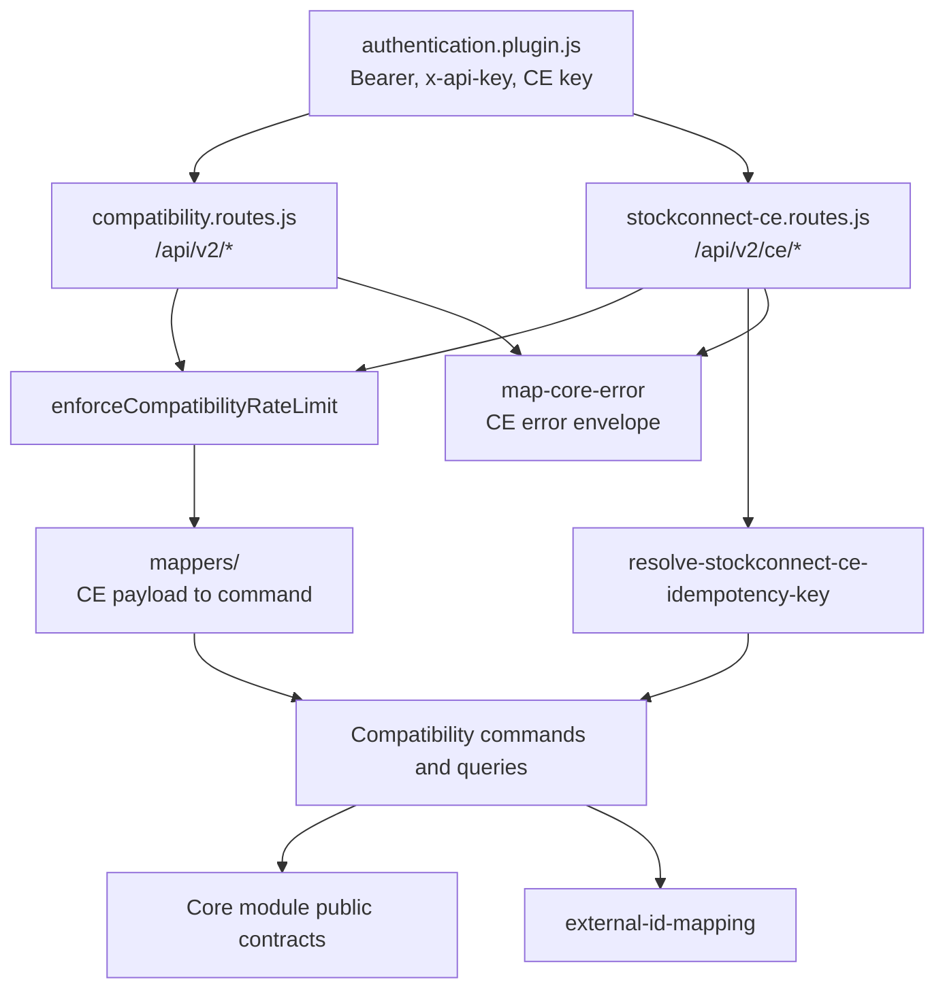
```mermaid
flowchart TD
  R1["compatibility.routes.js<br/>/api/v2/*"]
  R2["stockconnect-ce.routes.js<br/>/api/v2/ce/*"]
  AUTH["authentication.plugin.js<br/>Bearer, x-api-key, CE key"]
  RL["enforceCompatibilityRateLimit"]
  MAP["mappers/<br/>CE payload to command"]
  IDEM["resolve-stockconnect-ce-idempotency-key"]
  CMD["Compatibility commands and queries"]
  PUB["Core module public contracts"]
  EID["external-id-mapping"]
  ERR["map-core-error<br/>CE error envelope"]

  AUTH --> R1
  AUTH --> R2
  R1 --> RL
  R2 --> RL
  RL --> MAP
  R2 --> IDEM
  IDEM --> CMD
  MAP --> CMD
  CMD --> PUB
  CMD --> EID
  R1 --> ERR
  R2 --> ERR
```

Both route plugins install their **own** Fastify error handler that converts errors to the CE envelope, so a compatibility client never sees Nexora's native error shape.

### Authentication for compatibility clients

Core authentication accepts a bearer JWT or an API key via `x-api-key` or `Authorization: ApiKey <key>`. The `/api/v2/ce/*` prefix accepts two **additional** credential channels, because ChannelEngine clients conventionally pass the key in the query string:

```javascript
if (apiKey === null && isMerchantCompatQueryAuthPath(path)) {
    apiKey = readMerchantCompatQueryApiKey(request.query)
        ?? readMerchantCompatCeKeyHeader(request.headers);
}
```

| Channel | Form | Accepted on |
| ------- | ---- | ----------- |
| Bearer JWT | `Authorization: Bearer <jwt>` | All protected routes |
| API key header | `x-api-key: <key>` | All protected routes |
| API key scheme | `Authorization: ApiKey <key>` | All protected routes |
| Query parameter | `?apiKey=<key>` or `?apikey=<key>` | **`/api/v2/ce/*` only** |
| CE header | `X-CE-KEY: <key>` | **`/api/v2/ce/*` only** |

The prefix restriction is enforced by `isMerchantCompatQueryAuthPath` in `src/shared/auth/merchant-compat-route-prefix.js`. An integration test confirms the boundary: a query `apiKey` on `GET /api/v2/orders` returns 401, while the same credential on a `/api/v2/ce` route succeeds. All five channels resolve to the same `verifyApiKey` verification path and therefore the same tenant scoping and RLS behaviour.

**Operational note.** Query-string credentials appear in access logs and proxy logs at any intermediary. The logging redaction configuration covers `x-api-key` and `x-ce-key` in Nexora's own logs, but an upstream load balancer will still record the full URL. This is an accepted consequence of the ChannelEngine contract, not an oversight.

### Endpoint inventory

#### Merchant surface, `/api/v2/*`

| Route ID | Method | Path | Purpose | Idempotency | Delegates to |
| -------- | ------ | ---- | ------- | ----------- | ------------ |
| R-0122 | GET | `/api/v2/foundation/ping` | Connectivity probe | — | Inline |
| R-0125 | GET | `/api/v2/orders` | List orders with filters | — | `OrderCompatibilityQuery.listOrders` |
| R-0129 | GET | `/api/v2/orders/new` | Orders in `NEW` status | — | `listNewOrders` |
| R-0126 | POST | `/api/v2/orders` | Channel order ingest, reserves stock | Required | `createChannelOrder` |
| R-0128 | POST | `/api/v2/orders/channel-fulfilled` | Ingest an order the channel already shipped | Required | `createChannelFulfilledOrder` |
| R-0127 | POST | `/api/v2/orders/acknowledge` | Acknowledge import | Required | `acknowledgeOrder` |
| R-0143 | GET | `/api/v2/shipments/merchant` | List shipments | — | `listMerchantShipments` |
| R-0141 | POST | `/api/v2/shipments` | Create a shipment | Required | `createShipment` |
| R-0142 | PUT | `/api/v2/shipments/:merchantShipmentNo` | Update tracking, transition to shipped | Required | `updateShipmentTracking` |
| R-0101 | GET | `/api/v2/cancellations/merchant` | List cancellations | — | `listMerchantCancellations` |
| R-0100 | POST | `/api/v2/cancellations` | Create a cancellation | Required | `createCancellation` |
| R-0140 | GET | `/api/v2/returns/merchant/new` | Unhandled returns | — | `listNewMerchantReturns` |
| R-0138 | GET | `/api/v2/returns/merchant/:merchantOrderNo` | Returns for one order | — | `listReturnsByMerchantOrderNo` |
| R-0137 | GET | `/api/v2/returns/merchant` | List returns | — | `listMerchantReturns` |
| R-0135 | POST | `/api/v2/returns` | Create a return | Required | `createReturn` |
| R-0136 | PUT | `/api/v2/returns` | Receive, accept or reject | Required | `receiveReturn` |
| R-0139 | POST | `/api/v2/returns/merchant/acknowledge` | Acknowledge a return | Required | `acknowledgeReturn` |
| R-0130 | GET | `/api/v2/products` | Products by merchant product numbers | — | `listProductsByMerchantProductNos` |
| R-0131 | POST | `/api/v2/products` | Batch product upsert | Required | `upsertProducts` |
| R-0134 | POST | `/api/v2/products/freeze` | Suspend offers or deactivate | Required | `freezeProducts` |
| R-0132 | POST | `/api/v2/products/bulkdelete` | Soft deactivate | Required | `bulkDeleteProducts` |
| R-0133 | PATCH | `/api/v2/products/extra-data/bulk` | Merge CE ExtraData | Required | `patchExtraDataBulk` |
| R-0123 | PUT | `/api/v2/offer` | Update offer price | Required | `updateOfferPrice` |
| R-0124 | PUT | `/api/v2/offer/stock` | Set absolute stock | Required | `updateOfferStock` |

#### StockConnect CE surface, `/api/v2/ce/*`

| Route ID | Method | Path | Purpose | Idempotency | Delegates to |
| -------- | ------ | ---- | ------- | ----------- | ------------ |
| R-0107 | GET | `/api/v2/ce/orders` | Order poll, `page` and `pageSize` | — | `listOrdersForStockConnectPoll` |
| R-0108 | GET | `/api/v2/ce/orders/:merchantOrderNo/invoice` | Invoice PDF | — | `StockConnectCeOrderInvoiceQuery` |
| R-0109 | POST | `/api/v2/ce/orders/acknowledge` | Acknowledge | Optional, derived | `acknowledgeOrder` |
| R-0102 | POST | `/api/v2/ce/cancellations` | Create a cancellation | Optional, derived | `createCancellation` |
| R-0119 | POST | `/api/v2/ce/shipments` | Create a shipment | Optional, derived | `createShipment` |
| R-0121 | GET | `/api/v2/ce/shipments/merchant` | List shipments | — | `listMerchantShipments` |
| R-0120 | PUT | `/api/v2/ce/shipments/:merchantShipmentNo/delivery-state` | Report delivery state | Computed, **not persisted** | `StockConnectCeShipmentDeliveryCommand` |
| R-0115 | GET | `/api/v2/ce/returns` | Return poll | — | `listMerchantReturns` |
| R-0117 | POST | `/api/v2/ce/returns/merchant` | Create a return | Optional, derived | `createReturn` |
| R-0118 | POST | `/api/v2/ce/returns/merchant/acknowledge` | Acknowledge a return | Optional, derived | `acknowledgeReturn` |
| R-0116 | PUT | `/api/v2/ce/returns` | Receive a return | Optional, derived | `receiveReturn` |
| R-0110 | GET | `/api/v2/ce/products` | Products by SKU list | — | `StockConnectCeProductsQuery` |
| R-0103 | GET | `/api/v2/ce/channels` | Channel registry | — | `StockConnectCeChannelCompatibilityQuery` |
| R-0104 | GET | `/api/v2/ce/channels/:channelId/products` | Channel listing status | — | `StockConnectCeChannelProductsQuery` |
| R-0111 | POST | `/api/v2/ce/products` | Product push | Computed, **not persisted** | `StockConnectCeCatalogCommand.pushProducts` |
| R-0106 | PUT | `/api/v2/ce/offer/stock` | Set stock | Computed, **not persisted** | `updateOfferStock` |
| R-0105 | PUT | `/api/v2/ce/offer` | Set price | Computed, **not persisted** | `updateOfferPrice` |
| R-0114 | POST | `/api/v2/ce/products/freeze` | Freeze or unfreeze | Computed, **not persisted** | `freezeProducts` |
| R-0112 | POST | `/api/v2/ce/products/bulkdelete` | Bulk delete or archive | Computed, **not persisted** | `bulkDeleteProducts` |
| R-0113 | PATCH | `/api/v2/ce/products/extra-data/bulk` | Extra data merge | Computed, **not persisted** | `patchExtraData` |

Routes present on `/api/v2` but deliberately **absent** from `/api/v2/ce`: `foundation/ping`, `orders/new`, filtered order listing, channel order ingest by POST, shipment tracking update by PUT, cancellation listing, and the per-order and new-return sub-routes.

### Identifier mapping

ChannelEngine clients expect integer identifiers. Nexora uses UUIDs internally. The bridge is the `external-id-mapping` module.

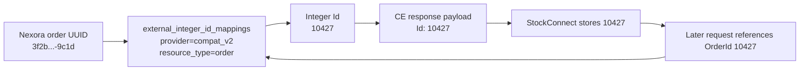
```mermaid
flowchart LR
  A["Nexora order UUID<br/>3f2b...-9c1d"] --> B["external_integer_id_mappings<br/>provider=compat_v2<br/>resource_type=order"]
  B --> C["Integer Id<br/>10427"]
  C --> D["CE response payload<br/>Id: 10427"]
  D --> E["StockConnect stores 10427"]
  E --> F["Later request references OrderId 10427"]
  F --> B
```

Integers are allocated monotonically per tenant, provider and resource type at the moment the entity is created — `assignOrderCompatibilityExternalIds` and its siblings run inside the creation transaction. Mapped resource types are `order`, `order_line`, `return`, `shipment` and `cancellation`.

Inbound resolution is handled by `compatibility-external-id-resolution.js`, which is strict about consistency. `resolveOrderForCompatibility` resolves `MerchantOrderNo` to an order number, and if the caller **also** supplies an `OrderId`, that integer must map to the same order or the request is rejected with 409 Conflict. This prevents a client with stale state from acting on the wrong order.

Two resource types are **not** in the mapping table. Products are addressed by SKU throughout. Channel integers are parsed directly from `channels.external_reference` when that column holds a numeric string, in `stockconnect-ce-channel.mapper.js` — so a channel whose external reference is non-numeric will not expose a `ChannelId` to CE clients.

### Idempotency

The two surfaces differ, and this is the most consequential behavioural difference between them.

| Surface | Header | Behaviour |
| ------- | ------ | --------- |
| `/api/v2` mutations | `Idempotency-Key` **required** | Missing header returns 400 |
| `/api/v2/ce` routes delegating to core commands | Optional | A deterministic key is derived when absent |
| `/api/v2/ce` catalog and delivery-state routes | Optional | A key is computed but **not passed to the ledger** |

Derivation when the header is absent:

```javascript
export function resolveStockConnectCeIdempotencyKey(input) {
    const rawHeader = Array.isArray(input.header) ? input.header[0] : input.header;
    if (typeof rawHeader === 'string' && rawHeader.trim().length > 0) {
        return rawHeader.trim();
    }
    const digest = createHash('sha256')
        .update(`${input.tenantId}\0${input.routeId}\0${input.fingerprint}`)
        .digest('hex');
    return `ce-compat:${digest}`;
}
```

The fingerprint is a stable SHA-256 over the request body with sorted keys, so two byte-identical requests produce the same key and the second is recognised as a replay. This gives StockConnect at-least-once retry safety without requiring it to generate keys.

One subtlety worth recording: when a CE route delegates to a core command, the **ledger row** is written with the canonical `/api/v2/...` route identifier, not the `/api/v2/ce/...` path. The CE route identifier participates only in the hash that derives the key. This is intentional and documented in `docs/architecture/compatibility-idempotency.md`, and it means the same logical operation is deduplicated consistently regardless of which surface issued it.

**The gap.** `StockConnectCeCatalogCommand` and `StockConnectCeShipmentDeliveryCommand` receive a computed key but never call the idempotency service. A retried `POST /api/v2/ce/products` or `PUT /api/v2/ce/offer/stock` can therefore repeat its side effects. For stock and price writes, which are absolute-value operations, a repeat is harmless. For `pushProducts`, which creates a product when the SKU is unknown, a genuine duplicate is prevented only by the tenant-unique SKU constraint.

### Error mapping

Core errors are translated to the ChannelEngine envelope by `mapCoreErrorToExternalApiResponse`:

```javascript
return {
    statusCode: mapped.statusCode,
    body: {
        Success: false,
        StatusCode: mapped.statusCode,
        Message: mapped.body.message,
        ...(validationErrors === undefined ? {} : { ValidationErrors: validationErrors }),
    },
};
```

Normalisation happens first: Zod issues and Fastify validation errors become `ValidationError`, a JSON parse failure becomes `MalformedRequestError`, and anything unrecognised becomes `InternalError`. The HTTP status comes from the `AppError`, so the status codes a CE client sees line up with the taxonomy in the API chapter. An integration test asserts that internal details are redacted rather than surfaced in `Message`.

### Product data flow

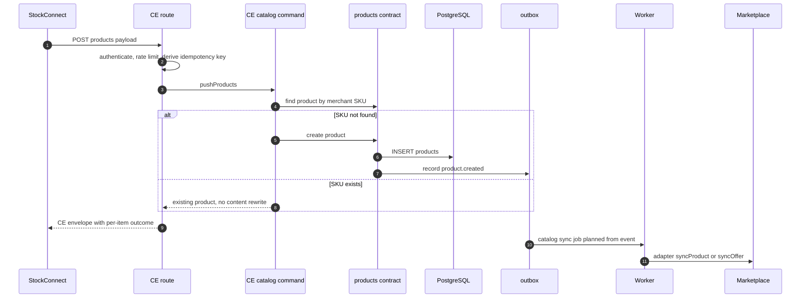
```mermaid
sequenceDiagram
  autonumber
  participant SC as StockConnect
  participant CE as CE route
  participant CMD as CE catalog command
  participant PRD as products contract
  participant PG as PostgreSQL
  participant OB as outbox
  participant W as Worker
  participant MP as Marketplace

  SC->>CE: POST products payload
  CE->>CE: authenticate, rate limit, derive idempotency key
  CE->>CMD: pushProducts
  CMD->>PRD: find product by merchant SKU
  alt SKU not found
    CMD->>PRD: create product
    PRD->>PG: INSERT products
    PRD->>OB: record product.created
  else SKU exists
    CMD-->>CE: existing product, no content rewrite
  end
  CE-->>SC: CE envelope with per-item outcome
  OB->>W: catalog sync job planned from event
  W->>MP: adapter syncProduct or syncOffer
```

Two catalog implementations exist and they are **not** the same code path.

| Aspect | `/api/v2/products` | `/api/v2/ce/products` |
| ------ | ------------------ | --------------------- |
| Command | `CatalogCompatibilityCommand` | `StockConnectCeCatalogCommand` |
| Request schema | Typed CE product schema | `z.array(z.record(z.unknown()))` |
| Behaviour | Full upsert with content mapping and channel resolution | Ensures a product row exists by SKU only |
| Idempotency ledger | Used | Not used |
| Authorization checks | Explicit | Lighter |
| Response | Partial-success envelope from `buildCeMutationEnvelope` | CE envelope with per-item outcomes |

An engineer debugging a "product pushed but fields missing" report on the CE surface should look here first: the CE push does not map rich product content.

Reading products also differs. `GET /api/v2/products` may require a content row to exist, whereas `GET /api/v2/ce/products` uses `mapProductToCeCatalogItem` and returns the product without requiring localised content.

### Inventory data flow

Stock arriving from StockConnect is an **absolute value**, not a delta. The CE contract's `PUT /offer/stock` semantics are "set the sellable quantity to this number".

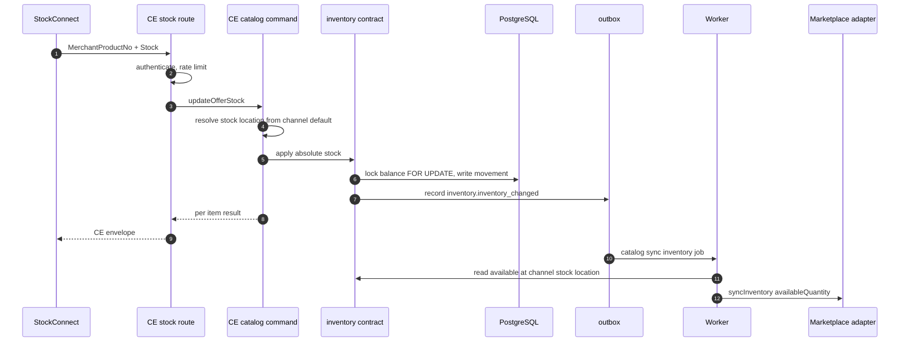
```mermaid
sequenceDiagram
  autonumber
  participant SC as StockConnect
  participant CE as CE stock route
  participant CMD as CE catalog command
  participant INV as inventory contract
  participant PG as PostgreSQL
  participant OB as outbox
  participant W as Worker
  participant ADP as Marketplace adapter

  SC->>CE: MerchantProductNo + Stock
  CE->>CE: authenticate, rate limit
  CE->>CMD: updateOfferStock
  CMD->>CMD: resolve stock location from channel default
  CMD->>INV: apply absolute stock
  INV->>PG: lock balance FOR UPDATE, write movement
  INV->>OB: record inventory.inventory_changed
  CMD-->>CE: per item result
  CE-->>SC: CE envelope
  OB->>W: catalog sync inventory job
  W->>INV: read available at channel stock location
  W->>ADP: syncInventory availableQuantity
```

The stock location is resolved from the channel's `defaultStockLocationId`, falling back to a UUID stored in `configurationReference`. When neither is set the sync job is skipped with a recorded reason rather than failing — a common cause of "inventory never reaches the marketplace" reports.

Note the direction change at the bottom of the diagram. Stock written *in* through CE is stored against a stock location; stock sent *out* to a marketplace is read back as `available` at the channel's location. The two are connected through the database, not passed directly, which is why an inventory write and the resulting marketplace update are separated in time.

### Pricing data flow

`PUT /api/v2/ce/offer` carries a price for a merchant product number. The CE catalog command defaults the currency to **SAR** when the payload omits it — a hard-coded default appropriate to the deployment region, worth knowing before assuming currency is always explicit. The price is written through the pricing contract as minor units with a validity window, then `price.created` or `price.updated` is recorded on the outbox, which plans a price sync job. The worker resolves the effective price through `getEffectivePrice` and the adapter converts minor units to whatever decimal format the marketplace expects.

### Order lifecycle

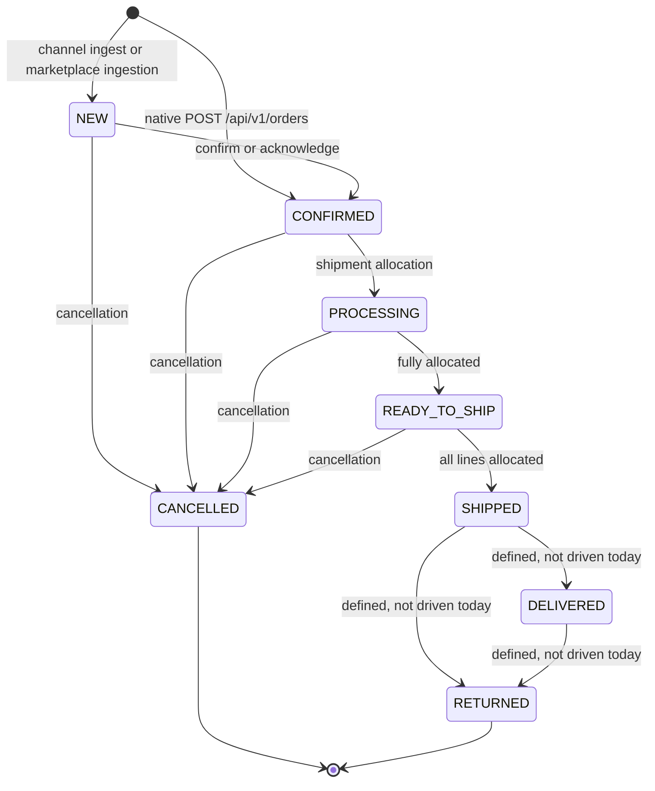
```mermaid
stateDiagram-v2
  [*] --> NEW: channel ingest or marketplace ingestion
  [*] --> CONFIRMED: native POST /api/v1/orders
  NEW --> CONFIRMED: confirm or acknowledge
  NEW --> CANCELLED: cancellation
  CONFIRMED --> PROCESSING: shipment allocation
  CONFIRMED --> CANCELLED: cancellation
  PROCESSING --> READY_TO_SHIP: fully allocated
  PROCESSING --> CANCELLED: cancellation
  READY_TO_SHIP --> SHIPPED: all lines allocated
  READY_TO_SHIP --> CANCELLED: cancellation
  SHIPPED --> DELIVERED: defined, not driven today
  SHIPPED --> RETURNED: defined, not driven today
  DELIVERED --> RETURNED: defined, not driven today
  CANCELLED --> [*]
  RETURNED --> [*]
```

Two behaviours in this machine regularly surprise newcomers and both are verified in code.

**`SHIPPED` can be reached before anything physically ships.** `DefaultOrderFulfillmentService.evaluateOrderShipmentState` advances the order through `PROCESSING` and `READY_TO_SHIP` to `SHIPPED` once every non-cancelled line is fully allocated to shipments, in a single transaction. The order status reflects *allocation*, and the shipment's own status reflects physical dispatch.

**`DELIVERED` and `RETURNED` are never set.** Both transitions exist in `LEGAL_TRANSITIONS`, but no application code calls `Order.transitionTo(OrderStatus.DELIVERED)` or `RETURNED`. Delivering a shipment updates the shipment only; receiving a return updates the return and the order line's returned quantity, not the order status. Any consumer treating order status as a delivery signal will wait indefinitely — they should read shipment status instead.

The CE order payload maps Nexora status onto the ChannelEngine vocabulary, for example `CONFIRMED` becoming `IN_PROGRESS` and `DELIVERED` becoming `CLOSED`.

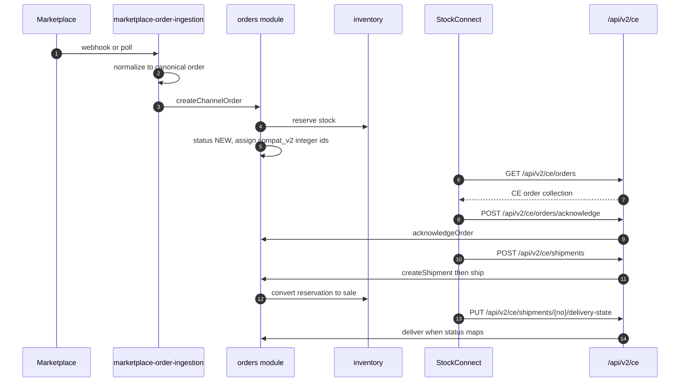
```mermaid
sequenceDiagram
  autonumber
  participant MP as Marketplace
  participant ING as marketplace-order-ingestion
  participant ORD as orders module
  participant INV as inventory
  participant SC as StockConnect
  participant CE as /api/v2/ce

  MP->>ING: webhook or poll
  ING->>ING: normalize to canonical order
  ING->>ORD: createChannelOrder
  ORD->>INV: reserve stock
  ORD->>ORD: status NEW, assign compat_v2 integer ids

  SC->>CE: GET /api/v2/ce/orders
  CE-->>SC: CE order collection
  SC->>CE: POST /api/v2/ce/orders/acknowledge
  CE->>ORD: acknowledgeOrder
  SC->>CE: POST /api/v2/ce/shipments
  CE->>ORD: createShipment then ship
  ORD->>INV: convert reservation to sale
  SC->>CE: PUT /api/v2/ce/shipments/{no}/delivery-state
  CE->>ORD: deliver when status maps
```

### Delivery-state reporting

`PUT /api/v2/ce/shipments/:merchantShipmentNo/delivery-state` accepts a CE delivery status. Only `DELIVERED` and `CLOSED` are mapped to the internal deliver flow. Any other value returns a successful HTTP response carrying `Applied: false` and `Reason: 'STATUS_NOT_MAPPED'`. The call succeeded; nothing changed. Clients that only check the HTTP status will believe a state was recorded when it was not.

### Invoice retrieval

`GET /api/v2/ce/orders/:merchantOrderNo/invoice` returns a PDF. If an `OrderInvoiceDocumentPort` implementation is wired, that provides the document. Otherwise `generateStockConnectCeInvoicePdf` produces one, and the file header states its scope plainly:

> Nexora does not yet store marketplace tax invoices; this generator produces a readable PDF so StockConnect can parse invoice metadata.

The generated document is a single-page PDF containing an invoice number of the form `CE-<merchantOrderNo>`, an invoice date, the merchant order number and, when available, the channel order number. It contains no line items, no tax breakdown and no totals. It satisfies a parser looking for invoice metadata; it is not a tax document.

### Outbound webhooks to StockConnect

Nexora can push order events to StockConnect rather than requiring polling. The mechanism reuses the general tenant webhook subsystem with a marker.

A webhook subscription whose **`description` is exactly `stockconnect-ce-bridge`** is recognised by `isStockConnectCeBridgeSubscription`. For such subscriptions the worker substitutes a CE-shaped payload strategy, and `buildStockConnectCeWebhookBody` renders the body as `{ "Content": [ ceOrder ] }` using the same order mapper as the polling endpoint — so a webhook payload and a poll response describe an order identically.

The bridged event types are exactly four:

`order.created`, `order.confirmed`, `order.status_changed`, `order.cancelled`

Delivery uses the standard signing and retry machinery described in the webhooks chapter, including the `X-Nexora-Signature` HMAC header. The description string is a magic value; changing it on a subscription silently reverts that subscription to the generic payload shape.

### Readiness for the compatibility surface

Two readiness probes are registered on the API process, `external_compat_ce_routes` and its legacy alias `stockconnect_ce_compat`. Both run the same synchronous check, `assertExternalCompatibilityCeRoutesWired`, confirming that four dependencies are present on the route dependency object: `stockConnectCeOrderCompatibilityQuery`, `stockConnectCeCatalogCommand`, `stockConnectCeOrderInvoiceQuery` and `stockConnectCeChannelCompatibilityQuery`.

What this tells you is that composition did not silently drop a CE handler — a real risk in a manually wired application. What it does **not** tell you is whether PostgreSQL is reachable, whether StockConnect is up, or whether any CE request has ever succeeded. Those are covered by the `postgres`, `redis` and `queue` probes and by actual traffic.

### Operational workflows

**Onboarding a StockConnect tenant.** Create the tenant, create a channel and set its `defaultStockLocationId`, set the channel's `externalReference` to a numeric string if CE channel identifiers are required, create an API key with the scopes the integration needs, and give StockConnect the base URL plus the key. Optionally create a webhook subscription with description `stockconnect-ce-bridge` for push delivery.

**Publishing catalogue changes.** StockConnect pushes products, then stock and price. Each write records an integration event; the outbox publisher enqueues sync jobs; the worker calls the marketplace adapter. Confirm with `GET /api/v2/ce/channels/:channelId/products`, which reports `PUBLISHED`, `DISABLED` or `NOTPUBLISHED` derived from the offer status.

**Processing orders.** StockConnect polls `GET /api/v2/ce/orders`, acknowledges, creates shipments, and reports delivery state. Note that the CE poll endpoint does **not** filter to new orders — see the limitations below.

**Recovering from a failed sync.** Sync failures do not fail the originating API call. Inspect worker logs for the catalog sync job, check whether the offer has an `externalReference`, whether the channel has a stock location, and whether the marketplace connection tests successfully via `POST /api/v1/channels/:channelId/marketplace-connection/test`.

### Troubleshooting

| Symptom | Likely cause | Where to look | Action |
| ------- | ------------ | ------------- | ------ |
| 401 on every CE call | Query key used on `/api/v2/*` rather than `/api/v2/ce/*` | `authentication.plugin.js`, `merchant-compat-route-prefix.js` | Move to the `/ce` prefix or send `x-api-key` |
| 401 intermittently | Both `Authorization` and an API key sent | Auth plugin dual-credential check | Send exactly one credential |
| 400 `VALIDATION_FAILED` on a v2 mutation | Missing `Idempotency-Key` | `requireIdempotencyKey` | Add the header; CE routes derive one automatically |
| 409 `CONFLICT` on an order operation | `OrderId` integer does not match `MerchantOrderNo` | `compatibility-external-id-resolution.js` | Re-fetch the order; do not reuse cached identifiers |
| 409 `IDEMPOTENCY_CONFLICT` | Same key, different body | `idempotency_records` | Use a new key for a genuinely different request |
| 429 | Compatibility rate policy exceeded | `rate-limit-policies.js` | Honour `Retry-After`; reads 120/min, mutations 60/min per credential |
| Product created but fields missing | CE `pushProducts` only ensures the SKU exists | `stockconnect-ce-catalog-command.js` | Use `/api/v2/products` for full upsert, or extend the CE command |
| Stock accepted but marketplace unchanged | Offer has no `externalReference`, or channel has no stock location | `execute-catalog-sync-job.js`, `resolve-channel-stock-location-id.js` | Set the offer external reference and the channel default stock location |
| Delivery state accepted but nothing changed | Status other than `DELIVERED` or `CLOSED` | `stockconnect-ce-shipment-delivery-command.js` | Check `Applied` and `Reason` in the response body |
| Order never reaches `DELIVERED` | No code drives that transition | `order-status.js` | Read shipment status instead |
| CE poll returns old orders | Poll has no `NEW`-only filter | `stockconnect-ce-order-compatibility-query.js` | Filter client-side, or use `/api/v2/orders/new` |
| `ChannelId` absent from CE payloads | Channel `externalReference` is not numeric | `stockconnect-ce-channel.mapper.js` | Set a numeric external reference |
| Duplicate side effects after retry | CE catalog routes bypass the idempotency ledger | `stockconnect-ce-catalog-command.js` | Treat these as at-least-once; prefer absolute-value operations |
| Readiness green but CE failing | The probe only checks wiring | `stockconnect-ce-readiness.js` | Check `postgres`, `redis`, `queue` probes and logs |

### Implementation status

**Implemented and covered by automated tests**

- The complete `/api/v2` Merchant surface with required idempotency
- The complete `/api/v2/ce` route set, asserted by a dedicated route-inventory integration test
- CE query-parameter and `X-CE-KEY` credential resolution, restricted to the `/ce` prefix
- Delegation of orders, shipments, cancellations and returns to shared compatibility commands
- `compat_v2` integer identifier allocation, enrichment and strict inbound resolution
- CE order polling, acknowledgement, channel listing, channel product status and product listing
- The CE error envelope with internal-detail redaction
- The `stockconnect-ce-bridge` webhook payload builder
- CE readiness probe wiring

**Partially implemented**

| Area | Limitation |
| ---- | ---------- |
| Invoice PDF | Metadata-only placeholder; no line items, tax or totals |
| CE catalog push | Ensures a product row exists by SKU; does not map rich content like `/api/v2` does |
| CE idempotency | Catalog and delivery-state routes compute a key but never persist it |
| CE order poll | No default `NEW`-only filter, unlike `/api/v2/orders/new` |
| Channel identifiers | Only exposed when `external_reference` is numeric |
| Delivery state | Only `DELIVERED` and `CLOSED` are mapped |
| Return receive | Partial accept or reject across lines is not supported |
| CE field coverage | Several accepted fields — tracking extras, cancellation reasons, refund amounts — are validated but ignored |

**Not implemented**

- Any outbound call to ChannelEngine; there is no client, no credentials, no configuration
- ChannelEngine asynchronous job, batch and queue administration APIs, recorded as out of scope
- Channel order ingest on the CE prefix; ingest exists only at `POST /api/v2/orders`
- Merchant-only routes on the CE prefix, listed earlier in this chapter
- Product and channel entries in the integer identifier table

**Verification status.** Automated unit and integration coverage for the compatibility surface is extensive — twenty-two unit test files and more than twenty-eight integration test files, including eight specifically named for StockConnect CE. However, `docs/architecture/stockconnect-ce-production-cutover.md` states explicitly that **live StockConnect staging and production traffic has not been exercised**, marking those checks as blocked by environment. No claim of production verification should be made on the strength of the in-repository tests alone.

### Future considerations

These are recommendations, not implemented behaviour.

| Area | Suggested direction |
| ---- | ------------------- |
| CE catalog idempotency | Route `StockConnectCeCatalogCommand` through the same idempotency service the core commands use |
| CE product push parity | Reuse `CatalogCompatibilityCommand`'s content mapping so both surfaces behave identically |
| Invoice documents | Implement `OrderInvoiceDocumentPort` against real invoice data or a marketplace provider |
| Order poll filtering | Add an explicit status filter to the CE poll so clients need not filter locally |
| Order delivery status | Decide whether shipment delivery should drive the order aggregate, and implement or document the decision |
| Webhook bridge marker | Replace the magic `description` string with an explicit subscription attribute |
| Live verification | Complete the staging exercise the cutover runbook identifies as outstanding |

---

## Product, inventory, pricing and order workflows

This chapter follows four end-to-end flows through the layers, to show how the modules described earlier cooperate.

### Publishing a product to a marketplace

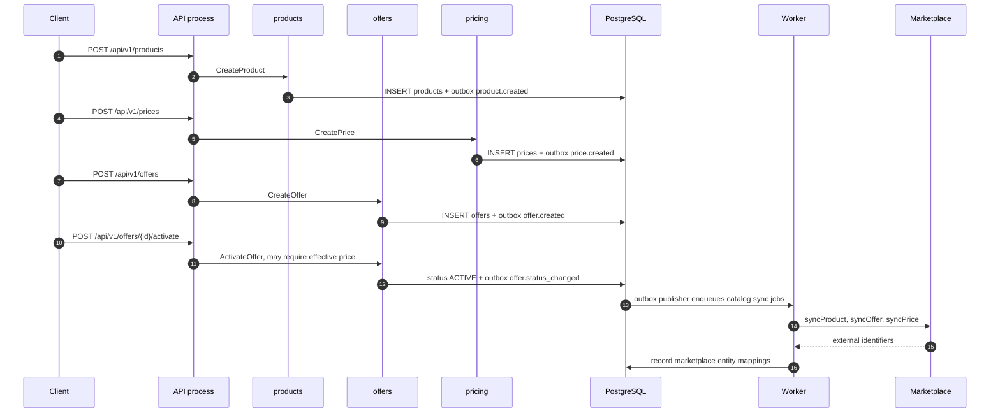
```mermaid
sequenceDiagram
  autonumber
  participant U as Client
  participant API as API process
  participant PRD as products
  participant OFR as offers
  participant PRC as pricing
  participant PG as PostgreSQL
  participant W as Worker
  participant MP as Marketplace

  U->>API: POST /api/v1/products
  API->>PRD: CreateProduct
  PRD->>PG: INSERT products + outbox product.created
  U->>API: POST /api/v1/prices
  API->>PRC: CreatePrice
  PRC->>PG: INSERT prices + outbox price.created
  U->>API: POST /api/v1/offers
  API->>OFR: CreateOffer
  OFR->>PG: INSERT offers + outbox offer.created
  U->>API: POST /api/v1/offers/{id}/activate
  API->>OFR: ActivateOffer, may require effective price
  OFR->>PG: status ACTIVE + outbox offer.status_changed
  PG->>W: outbox publisher enqueues catalog sync jobs
  W->>MP: syncProduct, syncOffer, syncPrice
  MP-->>W: external identifiers
  W->>PG: record marketplace entity mappings
```

The order of these calls matters. Activating an offer configured to resolve pricing will fail if no effective price exists for the channel and currency, which is a deliberate guard against publishing an unpriced listing.

### Inventory movement through an order's life

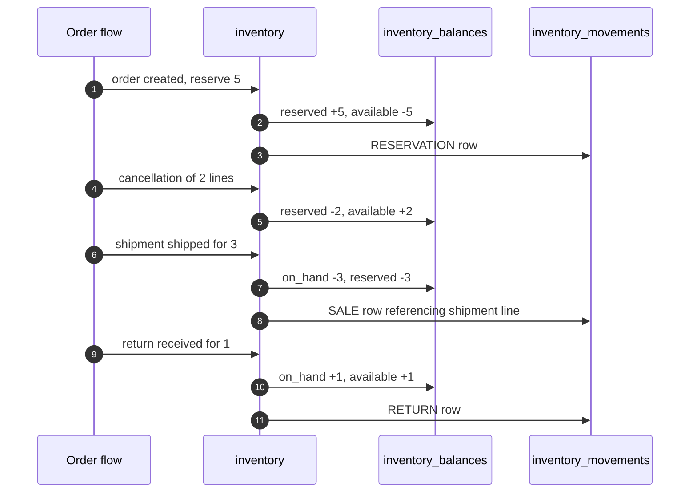
```mermaid
sequenceDiagram
  autonumber
  participant O as Order flow
  participant INV as inventory
  participant B as inventory_balances
  participant M as inventory_movements

  O->>INV: order created, reserve 5
  INV->>B: reserved +5, available -5
  INV->>M: RESERVATION row
  O->>INV: cancellation of 2 lines
  INV->>B: reserved -2, available +2
  O->>INV: shipment shipped for 3
  INV->>B: on_hand -3, reserved -3
  INV->>M: SALE row referencing shipment line
  O->>INV: return received for 1
  INV->>B: on_hand +1, available +1
  INV->>M: RETURN row
```

At every step the invariant `available = on_hand − reserved` holds, and every step leaves an immutable movement row. Reconstructing why a balance is what it is is therefore always possible from `inventory_movements`.

### Channel-fulfilled orders

When a marketplace has already shipped the goods, reserving stock would be wrong — the stock has left. `POST /api/v2/orders/channel-fulfilled` creates the order with an inventory consumption mode of `record_sale_only`. No reservation is taken at creation, and when the associated shipment is marked shipped, `fulfillInventoryWhenShipmentShipped` calls `recordSale` instead of `fulfillReservedForShipment`. The net effect on `on_hand` is the same; the difference is that `available` drops at shipment rather than at order creation.

### Request equivalence in practice

Consider a marketplace webhook delivered twice. The second delivery calls `CreateChannelOrder` with the same channel and the same `externalOrderReference`. Rather than creating a duplicate or failing, the use case loads the existing order and runs `isEquivalentChannelOrderRequest`, comparing channel, currency, discount, tax and shipping totals, a sorted line snapshot and a normalised customer record.

| Outcome | Response |
| ------- | -------- |
| Payloads equivalent | The existing order is returned with `ingestionOutcome: 'duplicate'` |
| Payloads differ | `ConflictError`, because the same external reference now describes different data |

The same pattern guards shipments, returns and cancellations on their `externalReference`. It complements, rather than replaces, `Idempotency-Key`: idempotency keys protect identical retries of the same HTTP call, while equivalence protects against duplicate ingestion of the same business event arriving by different routes.

---

## Queue and background processing

### Queues and jobs

| Queue | Job name | Handler behaviour |
| ----- | -------- | ----------------- |
| `integration-events` | `publish-integration-event` | Routes an outbox event to its in-process consumers |
| `webhook-deliveries` | `deliver-webhook` | Signs and POSTs a webhook, classifies the response |
| `channel-catalog-sync` | `run-catalog-sync` | Executes one product, offer, price or inventory sync |
| `marketplace-order-lifecycle` | `process-marketplace-lifecycle` | Processes webhook events, inbound lifecycle commands and outbound operations |

All four are BullMQ queues backed by Redis, sharing one configuration:

| Setting | Environment variable | Default |
| ------- | -------------------- | ------: |
| Attempts | `QUEUE_DEFAULT_ATTEMPTS` | 5 |
| Backoff base, exponential | `QUEUE_BACKOFF_BASE_MS` | 1000 |
| Worker concurrency | `QUEUE_WORKER_CONCURRENCY` | 5 |
| Job lock duration | `QUEUE_JOB_TIMEOUT_MS` | 30000 |
| Key prefix | `QUEUE_PREFIX` | `nexora-queue` |
| Redis URL | `QUEUE_REDIS_URL`, falling back to `REDIS_URL` | — |

### Worker architecture

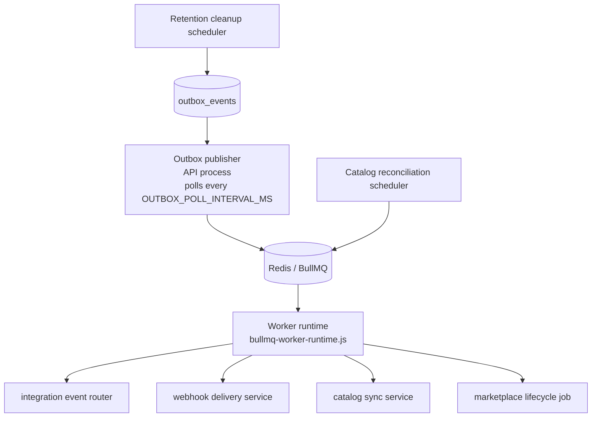
```mermaid
flowchart TD
  OB["Outbox publisher<br/>API process<br/>polls every OUTBOX_POLL_INTERVAL_MS"]
  PG[("outbox_events")]
  RQ[("Redis / BullMQ")]
  WR["Worker runtime<br/>bullmq-worker-runtime.js"]
  H1["integration event router"]
  H2["webhook delivery service"]
  H3["catalog sync service"]
  H4["marketplace lifecycle job"]
  SCH1["Retention cleanup scheduler"]
  SCH2["Catalog reconciliation scheduler"]

  PG --> OB --> RQ --> WR
  WR --> H1
  WR --> H2
  WR --> H3
  WR --> H4
  SCH1 --> PG
  SCH2 --> RQ
```

Each job executes inside an AsyncLocalStorage request context carrying a correlation identifier, so worker log lines can be joined to the API request that originally produced the event.

### Retry semantics

Three distinct retry mechanisms coexist, and confusing them makes failures hard to diagnose.

| Mechanism | Used by | Behaviour |
| --------- | ------- | --------- |
| BullMQ attempts with exponential backoff | All queues | Generic failure retry up to `QUEUE_DEFAULT_ATTEMPTS` |
| `moveToDelayed` with a computed delay | Webhook delivery, catalog sync | The handler decides the delay — for example honouring `Retry-After` |
| Permanent failure, no retry | Catalog sync, webhook delivery | Adapter classified the error as permanent; logged and dropped |

A catalog sync job raising `CatalogSyncRetryError` is delayed and retried; an adapter authentication or validation error is classified permanent and logged without a retry, because retrying bad credentials or an invalid payload cannot succeed.

### Schedulers

| Scheduler | Process | Trigger | Purpose |
| --------- | ------- | ------- | ------- |
| Outbox publisher | API | `OUTBOX_POLL_INTERVAL_MS`, default 1000 | Move committed events onto the queue |
| Retention cleanup | Worker | `RETENTION_CLEANUP_INTERVAL_MS`, default 3600000 | Delete aged outbox, inbox, idempotency and delivery rows |
| Catalog sync reconciliation | Worker | `CATALOG_SYNC_RECONCILIATION_INTERVAL_MS`, default 86400000, only when enabled | Re-plan sync jobs for offers that may have drifted |

Reconciliation is **disabled by default** (`CATALOG_SYNC_RECONCILIATION_ENABLED` defaults to false). It exists because event-driven sync can miss changes when a job is permanently failed or an event is lost; the periodic sweep re-plans jobs for a bounded batch of offers per tick.

---

## Marketplace integrations

### Adapter ports

Provider code is reached only through five interfaces, so adding a marketplace means implementing ports rather than modifying core code.

| Port | Responsibility | Key methods |
| ---- | -------------- | ----------- |
| `MarketplaceCatalogAdapter` | Outbound catalogue | `testConnection`, `syncProduct`, `syncOffer`, `syncPrice`, `syncInventory`, `getCapabilities` |
| `MarketplaceAdapterRuntime` | Credentials and configuration for one channel | Produced by `createForSync` |
| `MarketplaceOrderAdapter` | Inbound orders | `listOrders`, `fetchOrder`, `normalizeWebhookOrder`, `normalizeLifecycleCommand` |
| `MarketplaceWebhookAdapter` | Inbound webhooks | `authenticateWebhookRequest`, `normalizeWebhookEvent` |
| `MarketplaceOutboundOrderLifecycleAdapter` | Outbound order actions | `cancelOrder`, `refundOrder`, `createFulfillment` |

### Support matrix

Read this table before promising a capability to a stakeholder. It reflects adapter code, not marketing.

| Capability | Amazon | Noon | Namshi | Shopify |
| ---------- | ------ | ---- | ------ | ------- |
| Connection test | Yes | Yes | Yes | Yes |
| Product sync | Partial — SKU mapping and availability, no full listing creation | **No** — throws unsupported | **No** — throws unsupported | Yes |
| Offer sync | Yes | Yes | Yes | Yes |
| Price sync | Yes | Yes | Yes | Yes |
| Inventory sync | Yes | Yes | Yes | Yes |
| Order polling | No | No | No | Yes |
| Order ingestion via lifecycle or webhook | Partial | Partial | Partial | Yes |
| Inbound lifecycle events | Yes | Yes | Yes | Partial |
| Outbound cancel | No | No | No | Yes |
| Outbound refund | No | No | No | Yes |
| Outbound fulfilment | Yes | Yes | Yes | Yes |
| Outbound returns | No | No | No | No |
| Inbound webhooks | Partial — SNS handshake unsupported | Yes | Yes | Yes when registered |

Noon and Namshi require SKUs to already exist on the marketplace; their `syncProduct` throws `MarketplaceUnsupportedError` by design, with a comment stating the precondition. Shopify is the only provider with a complete inbound and outbound order lifecycle.

### Authentication per provider

| Provider | Mechanism |
| -------- | --------- |
| Amazon SP-API | LWA refresh token exchanged for an access token, requests signed AWS4-HMAC-SHA256 for `execute-api` |
| Noon | RS256 JWT login producing a cookie session |
| Namshi | RS256 JWT login producing a cookie session |
| Shopify | Admin API access token; webhooks verified by base64 HMAC-SHA256 |

Credentials are stored encrypted in `marketplace_connections.credentials_ciphertext` and decrypted by the runtime factory when a sync job runs. They are never returned by the read endpoint, and connection-test errors pass through `sanitizeMarketplaceConnectionTestError`, which strips secret-looking substrings and truncates to 500 characters.

### Catalog synchronisation pipeline

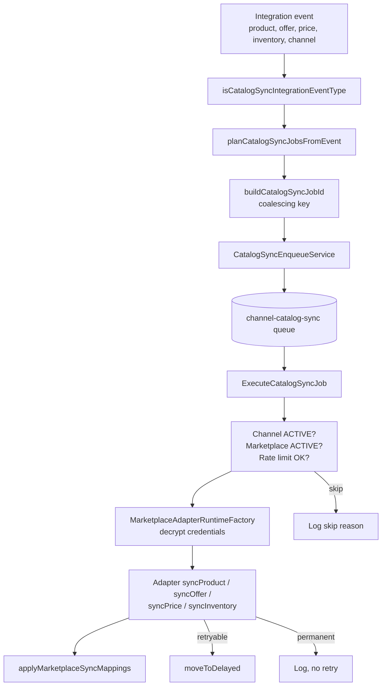
```mermaid
flowchart TD
  EV["Integration event<br/>product, offer, price, inventory, channel"]
  FIL["isCatalogSyncIntegrationEventType"]
  PLAN["planCatalogSyncJobsFromEvent"]
  JID["buildCatalogSyncJobId<br/>coalescing key"]
  ENQ["CatalogSyncEnqueueService"]
  Q[("channel-catalog-sync queue")]
  EXE["ExecuteCatalogSyncJob"]
  GATE["Channel ACTIVE?<br/>Marketplace ACTIVE?<br/>Rate limit OK?"]
  RT["MarketplaceAdapterRuntimeFactory<br/>decrypt credentials"]
  ADP["Adapter syncProduct / syncOffer /<br/>syncPrice / syncInventory"]
  MAPS["applyMarketplaceSyncMappings"]

  EV --> FIL --> PLAN --> JID --> ENQ --> Q --> EXE --> GATE --> RT --> ADP --> MAPS
  GATE -->|skip| SKIP["Log skip reason"]
  ADP -->|retryable| RETRY["moveToDelayed"]
  ADP -->|permanent| PERM["Log, no retry"]
```

The job identifier is the coalescing mechanism. Inventory jobs use a key of tenant, channel, target and entity, so a burst of stock changes for one product collapses into a single pending job rather than a queue of redundant updates. Price job keys additionally include currency.

The rate limiter allows 120 sync operations per minute per tenant-and-channel pair. This limit is **hard-coded** in `rate-limit-policies.js` and has no environment override, unlike the reconciliation settings.

### Order ingestion

```mermaid
flowchart TD
  P["Polling<br/>FetchAndIngestMarketplaceOrders"]
  W["Inbound webhook<br/>ReceiveMarketplaceWebhook"]
  L["Lifecycle command<br/>ProcessMarketplaceLifecyclePayload"]
  N["Normalized order schema"]
  ENS["EnsureMarketplaceOrderIngestedFromLifecycle"]
  SVC["MarketplaceOrderIngestionService.ingest"]
  RES["resolveMarketplaceOrderLines<br/>entity mappings then products"]
  CCO["CreateChannelOrder"]
  DUP{"Existing external reference?"}
  OK["New order, reserve stock"]
  EQ["Equivalent: return duplicate"]
  CF["Different: ConflictError"]

  P --> N
  W --> L --> ENS --> N
  N --> SVC --> RES --> CCO --> DUP
  DUP -->|no| OK
  DUP -->|yes, equivalent| EQ
  DUP -->|yes, different| CF
```

Only three normalized statuses are ingestible as new orders: `pending`, `confirmed` and `unknown`. An order arriving already cancelled or already fulfilled is not created through this path.

Lifecycle application is deduplicated through the idempotency service using the marketplace's `externalEventId` as the key under route identifier `marketplace-order-lifecycle.apply`, so a marketplace redelivering the same event does not apply it twice.

### Inbound webhook flow

```mermaid
sequenceDiagram
  autonumber
  participant MP as Marketplace
  participant R as Ingress route
  participant RES as Connection resolver
  participant PG as PostgreSQL
  participant ADP as Webhook adapter
  participant IDEM as Idempotency
  participant Q as Lifecycle queue

  MP->>R: POST raw body
  R->>RES: hash ingress token SHA-256
  RES->>PG: app.lookup_marketplace_connection_for_webhook
  PG-->>RES: connection, channel, tenant, marketplace key
  RES-->>R: resolved connection
  R->>ADP: authenticateWebhookRequest with raw body
  ADP-->>R: authenticated
  R->>ADP: normalizeWebhookEvent
  ADP-->>R: canonical event with deduplicationKey
  R->>IDEM: check deduplicationKey
  IDEM-->>R: first occurrence
  R->>Q: enqueue lifecycle job
  R-->>MP: 200
```

The route is public because the tenant is unknown until the ingress token is resolved. The token is stored only as a SHA-256 hash, and the lookup uses a `SECURITY DEFINER` function so it can run before any tenant context exists. Provider authentication then applies on top: Shopify verifies an HMAC over the raw body, Noon and Amazon parse and validate the envelope, and Namshi relies on the ingress token alone.

The raw body must be preserved byte-for-byte for HMAC verification, which is why the route captures `marketplaceWebhookRawBody` rather than working from the parsed JSON.

---

## Webhooks

This chapter covers **outbound** webhooks — Nexora notifying a tenant's endpoint. Inbound marketplace webhooks are covered in the previous chapter.

### Subscription model

A subscription holds a destination URL, an encrypted secret, and a list of event types. Event types are validated at creation against the catalogue's external-delivery allowlist, so a subscription cannot be created for an event that will never be dispatched. The destination URL is validated against the SSRF rules described below.

### Event catalogue

Twenty-eight integration event types exist in `src/shared/events/event-catalog.js`:

| Domain | Events |
| ------ | ------ |
| Orders | `order.created`, `order.confirmed`, `order.status_changed`, `order.cancelled` |
| Shipments | `shipment.created`, `shipment.shipped`, `shipment.delivered`, `shipment.cancelled`, `shipment.status_changed` |
| Cancellations | `cancellation.created`, `cancellation.completed` |
| Returns | `return.created`, `return.status_changed` |
| Products | `product.created`, `product.updated`, `product.status_changed` |
| Inventory | `inventory.inventory_changed`, `inventory.inventory_reserved`, `inventory.inventory_released` |
| Offers | `offer.created`, `offer.updated`, `offer.status_changed` |
| Channels | `channel.created`, `channel.updated`, `channel.status_changed` |
| Prices | `price.created`, `price.updated`, `price.changed` |

### Delivery

```mermaid
sequenceDiagram
  autonumber
  participant OB as Outbox event
  participant D as Dispatch service
  participant PG as webhook_deliveries
  participant Q as Delivery queue
  participant DS as Delivery service
  participant SSRF as SSRF validator
  participant EP as Tenant endpoint

  OB->>D: event
  D->>D: isExternallyDeliverable?
  D->>PG: INSERT delivery, unique subscription+event
  D->>Q: enqueue job id subscriptionId_eventId
  Q->>DS: deliver
  DS->>SSRF: re-validate destination
  DS->>DS: HMAC-SHA256 sign body
  DS->>EP: POST with signature headers
  EP-->>DS: status
  alt 2xx
    DS->>PG: DELIVERED
  else 408, 425, 429, 5xx
    DS->>Q: moveToDelayed, honour Retry-After
  else other 3xx or 4xx
    DS->>PG: FAILED permanently
  end
```

Headers sent with every delivery:

| Header | Content |
| ------ | ------- |
| `X-Nexora-Signature` | `v1=<hex>` HMAC-SHA256 of the request body using the subscription secret |
| `X-Nexora-Event` | Event type |
| `X-Nexora-Event-Id` | Event identifier |
| `X-Nexora-Delivery-Id` | Delivery attempt identifier |

Response classification is explicit: 408, 425, 429 and any 5xx are retryable; all other non-2xx responses are permanent failures. A `Retry-After` header on a retryable response is honoured up to `WEBHOOK_DELIVERY_MAX_RETRY_AFTER_SECONDS`. When attempts are exhausted the delivery is marked dead-lettered and remains queryable through `GET /api/v1/webhooks/:webhookId/deliveries`.

### SSRF protection

`validateOutboundWebhookUrl` runs at both subscription time and delivery time. It requires HTTPS, rejects URLs containing embedded credentials, resolves all A and AAAA records, and blocks private, loopback, link-local and cloud metadata address ranges. Validating again at delivery time defends against DNS rebinding between registration and use.

Destinations are logged through `sanitizeWebhookDestinationForLog`, which records only host and pathname, so query-string tokens in a destination URL do not reach the logs.

### Secret rotation

`POST /api/v1/webhooks/:webhookId/rotate-secret` requires the `webhooks.manage` permission plus a valid MFA step-up session, and is rate limited under the `webhook.secret-rotate` policy.

---

## External services

| Service | Direction | Purpose | Configuration by name |
| ------- | --------- | ------- | --------------------- |
| PostgreSQL | Outbound | Source of truth | `DATABASE_URL`, `DATABASE_MIGRATION_URL`, pool and timeout variables |
| Redis | Outbound | Cache, locks, rate limiting, queue | `REDIS_URL`, `REDIS_KEY_PREFIX`, `QUEUE_REDIS_URL` |
| S3-compatible storage | Outbound | Object storage provider, wired but unused by domain modules | `STORAGE_BUCKET`, `STORAGE_REGION`, `STORAGE_ENDPOINT`, `STORAGE_ACCESS_KEY_ID`, `STORAGE_SECRET_ACCESS_KEY`, `STORAGE_FORCE_PATH_STYLE` |
| OTLP collector | Outbound | Trace export | `TRACING_ENABLED`, `OTEL_EXPORTER_OTLP_ENDPOINT`, `OTEL_SERVICE_NAME` |
| Amazon SP-API | Outbound | Catalogue, inventory, price, fulfilment | Per-channel credentials; `AMAZON_LWA_TOKEN_URL` optional |
| Noon | Outbound | Catalogue, inventory, price, fulfilment | Per-channel credentials |
| Namshi | Outbound | Catalogue, inventory, price, fulfilment | Per-channel credentials |
| Shopify | Both | Full catalogue and order lifecycle | Per-channel credentials; `SHOPIFY_ADMIN_API_VERSION` optional |
| StockConnect | Inbound plus outbound webhooks | Consumes the CE compatibility API | Authenticated by tenant API key; no Nexora-side configuration |
| Tenant webhook endpoints | Outbound | Event notification | Per-subscription URL and secret |

### Outbound HTTP client

All outbound HTTP goes through `src/infrastructure/http/fetch-http-client.js`, which applies a default timeout of `HTTP_CLIENT_TIMEOUT_MS`, propagates the `x-request-id` header, and constructs a W3C `traceparent` header from the active OpenTelemetry trace. `GET` and `HEAD` are retried once on timeout; `POST` is not retried automatically, because the client cannot know whether the request was idempotent. URLs are redacted before logging.

### A configuration inconsistency worth knowing

`create-application.js` reads `config.marketplace.noonApiBaseUrl` and `config.marketplace.noonUserAgent`, but `src/app/config/config.js` only populates `shopifyAdminApiVersion` and `amazonLwaTokenUrl`, and no `NOON_*` variables exist in the schema. Those two values are therefore always `undefined` at runtime, and the Noon adapters fall back to the in-code defaults in `noon-config.js`. This is harmless today but will confuse anyone who tries to override the Noon base URL by setting an environment variable.

---

## Error handling and observability

### Error normalisation

Every error passing through the API converges on one path. `src/app/errors/error-mapper.js` normalises the input: an `AppError` passes through, a `ZodError` becomes a `ValidationError` with field issues, a `SyntaxError` becomes a `MalformedRequestError`, a Fastify `FST_ERR_VALIDATION` becomes a `ValidationError`, and anything else becomes an `InternalError`. The envelope builder then produces the JSON described in the API chapter.

Operational errors — those the `AppError` marks as expected — are logged at `warn`; everything else is logged at `error`. This keeps alerting signal high, because a client sending an invalid payload does not raise the same log level as an unexpected exception.

### Structured logging

Pino emits JSON with base fields `service` and `env`, enriched per request from AsyncLocalStorage with `requestId`, `traceId`, `tenantId` and `userId`. Redaction is configured at two levels: `PINO_REDACT_PATHS` covers header and body paths such as `authorization`, cookies, `x-api-key`, `x-ce-key`, tokens and passwords, and `redactDeep` handles arbitrary nested payloads, masking PII such as email addresses to the form `j***@domain`.

Access logs are written on `onResponse` with method, route, status code and elapsed time.

### Metrics

Exposed at `/internal/metrics` on the API process and on the worker's observability port.

| Group | Metric names |
| ----- | ------------ |
| HTTP | `http_requests_total`, `http_request_duration_seconds`, `http_request_errors_total` |
| Database | `db_pool_connections`, `db_query_duration_seconds` |
| Redis | `redis_operations_total`, `redis_operation_duration_seconds` |
| Queue | `queue_jobs_total`, `queue_job_duration_seconds` |
| Security | `rate_limit_hits_total`, `auth_events_total` |
| Commerce | `commerce_operations_total` |
| Webhooks | `webhook_delivery_attempts_total`, `webhook_delivery_duration_seconds` |
| Retention | `nexora_retention_cleanup_deleted_total`, `_runs_total`, `_failures_total`, `_duration_seconds` |
| Catalog sync | `channel_catalog_sync_jobs_total`, `channel_catalog_reconciliation_*` |
| Marketplace | `marketplace_order_ingestion_total`, `marketplace_webhook_total`, `marketplace_order_lifecycle_total`, `marketplace_lifecycle_worker_jobs_total` |

Node default metrics are also collected. The database pool gauge is refreshed on a five-second interval in both processes.

### Tracing

OpenTelemetry is enabled when `TRACING_ENABLED` is true and `OTEL_EXPORTER_OTLP_ENDPOINT` is set — configuration validation rejects the first without the second. HTTP, `pg` and `ioredis` are instrumented, and the HTTP instrumentation ignores `/health` and `/internal/metrics` to avoid flooding traces with probe traffic. Trace identifiers flow into log lines and into outbound `traceparent` headers.

### Health and readiness

| Endpoint | Process | Semantics |
| -------- | ------- | --------- |
| `GET /health/live` | API | Always `{ status: 'ok' }`; does not reflect shutdown |
| `GET /health/ready` | API | 200 with checks, or 503 when any probe fails or shutdown started |
| `GET /health/live` | Worker | 503 `{ status: 'shutting_down' }` during drain |
| `GET /health/ready` | Worker | Worker probe set |

Use readiness, not liveness, for load-balancer removal on the API process.

### Diagnostic workflow

```mermaid
flowchart LR
  S["Report: operation failed"]
  A{"Did the HTTP call fail?"}
  B["Read error code and requestId<br/>from the response envelope"]
  C["Search logs by requestId"]
  D{"Synchronous or background?"}
  E["Trace the use case in the module"]
  F["Check queue metrics and worker logs<br/>by correlationId"]
  G{"External call involved?"}
  H["Check adapter error classification<br/>and connection test"]
  I["Check readiness probes and<br/>dependency health"]

  S --> A
  A -->|yes| B --> C --> D
  A -->|no, silent| D
  D -->|synchronous| E
  D -->|background| F
  F --> G
  G -->|yes| H
  G -->|no| I
  E --> I
```

The `requestId` returned in every error envelope and in the `x-request-id` header is the primary correlation key; for background work, the correlation identifier carried into the job context serves the same purpose.

---

## Development environment

### Prerequisites

| Requirement | Version |
| ----------- | ------- |
| Node.js | 24 or later, per `engines` |
| npm | 10.9.2, per `packageManager` |
| Docker and Docker Compose | For PostgreSQL, Redis and MinIO |

### First run

```bash
npm install
cp .env.example .env          # then fill in the required values
docker compose up -d          # postgres, redis, minio
npm run migrate               # apply migrations
npm run dev                   # API on SERVER_PORT, default 3000
npm run dev:worker            # worker, in a second terminal
```

The Compose stack publishes PostgreSQL on host port **5433**, mapped to 5432 in the container. Note that `docs/operations/README.md` states 5432; the Compose file is authoritative.

### Required configuration

Only a few variables have no usable default:

| Variable | Why it is required |
| -------- | ------------------ |
| `DATABASE_URL` | No default connection string |
| `REDIS_URL` | No default |
| `STORAGE_BUCKET`, `STORAGE_ACCESS_KEY_ID`, `STORAGE_SECRET_ACCESS_KEY` | Storage provider is constructed at bootstrap |
| `AUTH_JWT_SECRET`, or both `AUTH_JWT_PRIVATE_KEY` and `AUTH_JWT_PUBLIC_KEY` | Enforced by cross-field validation |

Configuration is validated at startup and the process exits on a violation. Cross-field rules enforced in `assertConsistency`:

- `DATABASE_POOL_MIN` must not exceed `DATABASE_POOL_MAX`
- `TRACING_ENABLED` requires `OTEL_EXPORTER_OTLP_ENDPOINT`
- In production, `SERVER_CORS_ORIGINS` must not contain `*`
- A JWT secret or a complete key pair must be present
- `AUTH_MFA_ENCRYPTION_KEY` must be exactly 32 characters
- `DATABASE_MIGRATION_URL` must parse as a URL when set
- `WEBHOOK_DELIVERY_TIMEOUT_MS` must not exceed `WEBHOOK_DELIVERY_LEASE_SECONDS × 1000`

### Configuration reference by concern

Names only; never commit values.

| Concern | Variables |
| ------- | --------- |
| Runtime | `NODE_ENV`, `APP_NAME`, `APP_INSTANCE_NAMESPACE` |
| HTTP server | `SERVER_HOST`, `SERVER_PORT`, `SERVER_SHUTDOWN_TIMEOUT_MS`, `SERVER_BODY_LIMIT_BYTES`, `SERVER_CORS_ORIGINS`, `SERVER_TRUST_INCOMING_REQUEST_ID`, `SERVER_TRUST_PROXY` |
| Database | `DATABASE_URL`, `DATABASE_MIGRATION_URL`, `DATABASE_POOL_MAX`, `DATABASE_POOL_MIN`, `DATABASE_CONNECTION_TIMEOUT_MS`, `DATABASE_IDLE_TIMEOUT_MS`, `DATABASE_STATEMENT_TIMEOUT_MS`, `DATABASE_QUERY_TIMEOUT_MS`, `DATABASE_SSL` |
| Redis | `REDIS_URL`, `REDIS_KEY_PREFIX`, `REDIS_CONNECT_TIMEOUT_MS`, `REDIS_COMMAND_TIMEOUT_MS` |
| Queue | `QUEUE_REDIS_URL`, `QUEUE_PREFIX`, `QUEUE_DEFAULT_ATTEMPTS`, `QUEUE_BACKOFF_BASE_MS`, `QUEUE_WORKER_CONCURRENCY`, `QUEUE_JOB_TIMEOUT_MS` |
| Storage | `STORAGE_ENDPOINT`, `STORAGE_REGION`, `STORAGE_BUCKET`, `STORAGE_ACCESS_KEY_ID`, `STORAGE_SECRET_ACCESS_KEY`, `STORAGE_FORCE_PATH_STYLE` |
| Outbox and idempotency | `OUTBOX_BATCH_SIZE`, `OUTBOX_POLL_INTERVAL_MS`, `OUTBOX_MAX_ATTEMPTS`, `IDEMPOTENCY_TTL_SECONDS` |
| Retention | `OUTBOX_RETENTION_DAYS`, `INBOX_RETENTION_DAYS`, `IDEMPOTENCY_RETENTION_DAYS`, `WEBHOOK_DELIVERY_RETENTION_DAYS`, `RETENTION_CLEANUP_BATCH_SIZE`, `RETENTION_CLEANUP_INTERVAL_MS` |
| Catalog reconciliation | `CATALOG_SYNC_RECONCILIATION_ENABLED`, `_INTERVAL_MS`, `_OFFER_BATCH_SIZE`, `_MAX_JOBS_PER_TICK` |
| Observability | `LOG_LEVEL`, `LOG_PRETTY`, `METRICS_ENABLED`, `TRACING_ENABLED`, `OTEL_EXPORTER_OTLP_ENDPOINT`, `OTEL_SERVICE_NAME` |
| Worker observability | `WORKER_OBSERVABILITY_HTTP_ENABLED`, `WORKER_OBSERVABILITY_HOST`, `WORKER_OBSERVABILITY_PORT`, `WORKER_OTEL_SERVICE_NAME` |
| Outbound HTTP and webhooks | `HTTP_CLIENT_TIMEOUT_MS`, `WEBHOOK_DELIVERY_TIMEOUT_MS`, `WEBHOOK_DELIVERY_LEASE_SECONDS`, `WEBHOOK_DELIVERY_MAX_RETRY_AFTER_SECONDS` |
| Documentation | `DOCS_ENABLED` |
| Authentication | `AUTH_JWT_SECRET`, `AUTH_JWT_PRIVATE_KEY`, `AUTH_JWT_PUBLIC_KEY`, `AUTH_ACCESS_TOKEN_TTL_SECONDS`, `AUTH_REFRESH_TOKEN_TTL_SECONDS`, `AUTH_MFA_ENCRYPTION_KEY`, `AUTH_STEP_UP_TTL_SECONDS`, `AUTH_PASSWORD_MIN_LENGTH`, `AUTH_PASSWORD_MAX_LENGTH` |
| Marketplace adapters | `SHOPIFY_ADMIN_API_VERSION`, `AMAZON_LWA_TOKEN_URL` |

There are **no** StockConnect or ChannelEngine environment variables. StockConnect authenticates with an ordinary tenant API key.

### npm scripts

| Script | Action |
| ------ | ------ |
| `dev` / `dev:worker` | Run the API or worker with `--watch` |
| `start` / `start:worker` | Run without watch |
| `migrate` / `migrate:status` | Apply or report migrations |
| `backfill:external-ids` | Populate compatibility integer identifiers for existing rows |
| `build` | Syntax check every file with `node --check` |
| `lint` / `lint:fix` | ESLint |
| `format` / `format:check` | Prettier |
| `arch:check` | dependency-cruiser boundary enforcement |
| `test` / `test:unit` | Unit suite |
| `test:integration` | Integration suite |
| `test:all` | Both |
| `verify` | `lint` then `arch:check` then `test:unit` |
| `docs:route-inventory` | Regenerate the route inventory |
| `docs:openapi-coverage` | Dump the OpenAPI snapshot and verify route coverage |

### Common local problems

| Symptom | Cause | Fix |
| ------- | ----- | --- |
| Process exits immediately with a configuration error | A required variable is missing or a cross-field rule failed | Read the message; it names the failing rule |
| `/health/ready` returns 503 with `storage: failed` | MinIO is not running or the bucket does not exist | `docker compose up -d`, confirm `minio-init` completed |
| Login returns 429 | The `auth.login` policy allows 10 attempts per 15 minutes | Wait, or clear the Redis key |
| Any rate-limited call fails when Redis is down | The limiter fails closed by design | Restore Redis |
| Connection refused on port 5432 | Compose publishes 5433 | Use 5433 in `DATABASE_URL` |
| Jobs never execute | The worker process is not running | Start `npm run dev:worker` |
| `/docs` returns 404 | `DOCS_ENABLED` is false | Enable it in the local environment |

---

## Testing strategy

### Suites

| Project | Location | Files | External dependencies |
| ------- | -------- | ----: | --------------------- |
| `unit` | `tests/unit/` | 136 | None |
| `integration` | `tests/integration/` | 73 | PostgreSQL, Redis, MinIO |

Integration tests run serially with a 30-second test timeout and a 60-second hook timeout. `tests/integration/setup.js` loads `.env` without overriding existing values and supplies local defaults. `tests/integration/helpers.js` builds a shared infrastructure singleton, and most tests then call `createApplication(infra)` and use Fastify's `inject()` rather than opening a socket.

### Coverage by area

| Area | Unit files | What is covered |
| ---- | ---------: | --------------- |
| Marketplaces | 28 | All four provider adapters, signing, token providers, error mapping, contracts |
| Compatibility | 22 | CE mappers, external identifier enrichment and resolution, idempotency derivation, invoice generation, error mapping |
| Channel catalog sync | 16 | Job planning, identifiers, reconciliation, rate limiting, per-target sync |
| Webhooks | 11 | Dispatch, signing, retry delay, URL validation, response classification |
| Marketplace order ingestion | 10 | Schemas, lifecycle service, normalization, job execution |
| Cross-cutting | 13 | Configuration, errors, validation, pagination, money, redaction, retention |
| Authorization | 4 | Permission patterns, effective permissions, service |
| Orders | 4 | Status machine, command service |
| Identity | 3 | Email, refresh rotation, auth failures |
| Workers | 3 | Job handlers, event router, observability HTTP |
| Architecture | 2 | Asserts dependency-cruiser rule names exist |
| Others | 1–2 each | Tenants, shipments, returns, cancellations, events, products, channels, API keys, security |

Integration coverage is strongest around compatibility, with more than twenty-eight files including eight named for StockConnect CE, and solid across authentication, tenancy, commerce, webhooks and marketplace flows.

### Running tests

```bash
npm run test:unit          # fast, no dependencies
docker compose up -d       # required for the next command
npm run test:integration
npm run test:all
npm run verify             # lint + arch:check + unit
```

### Verified results

At the time of writing, `npm run test:unit` completed with **623 tests passing across 136 files**. The integration suite was not executed in full for this document, so no claim is made about its current pass rate. One known environment-dependent failure exists: `tests/integration/http.test.js` asserts `/health/ready` returns 200, which fails when a local dependency such as MinIO is unavailable.

### Gaps

| Gap | Note |
| --- | ---- |
| No CI workflow in the repository | `.github/workflows/` does not exist |
| `verify` excludes integration tests, Prettier and the syntax check | Intentional for speed; run them separately before release |
| No coverage thresholds configured | Coverage is not measured in the repository |
| Live StockConnect verification absent | Stated in the cutover runbook |
| Real marketplace APIs are not called in tests | Adapters are exercised against fixtures |
| Documentation drift | `tests/README.md` references TypeScript and a typecheck step that do not exist |

---

## Deployment and operations

### Container image

The `Dockerfile` is a multi-stage build on Node 24 Alpine. The runtime stage installs production dependencies only, runs as the unprivileged `node` user, uses `tini` as PID 1 for correct signal handling, exposes port 3000, and defaults to `node src/app/main.js`. The worker uses the same image with the command overridden to `node src/workers/main.js`.

### Process topology

```mermaid
flowchart LR
  LB["Load balancer / ingress"]
  A1["API replica 1"]
  A2["API replica N"]
  W1["Worker replica 1"]
  W2["Worker replica N"]
  PG[("PostgreSQL")]
  RD[("Redis")]
  PROM["Prometheus"]

  LB --> A1
  LB --> A2
  A1 --> PG
  A2 --> PG
  A1 --> RD
  A2 --> RD
  W1 --> PG
  W2 --> PG
  RD --> W1
  RD --> W2
  PROM -->|"/internal/metrics"| A1
  PROM -->|"worker port"| W1
```

API replicas scale with request volume; worker replicas scale with job volume. Both are stateless. Scheduled work is safe to run on multiple worker replicas because the retention job takes a distributed lock, and catalog sync jobs are coalesced by deterministic job identifiers.

### Probe configuration

| Purpose | API | Worker |
| ------- | --- | ------ |
| Liveness | `GET /health/live` on `SERVER_PORT` | `GET /health/live` on `WORKER_OBSERVABILITY_PORT` |
| Readiness | `GET /health/ready` on `SERVER_PORT` | `GET /health/ready` on the worker port |
| Metrics scrape | `GET /internal/metrics` | Same path on the worker port |

The worker observability listener binds `127.0.0.1` by default. In-cluster probes require `WORKER_OBSERVABILITY_HOST=0.0.0.0`, and ADR-026 is explicit that this port must never be exposed through a public load balancer.

### Migrations in production

Run migrations as a separate step before rolling out new application pods, using a privileged role. Set `DATABASE_MIGRATION_URL` to that role's connection string and `DATABASE_URL` to the restricted `nexora_app` role, so that runtime traffic is subject to row-level security while DDL is not.

Migrations are forward-only. There are no down migrations; a bad migration is corrected by writing a new one.

### Shutdown behaviour

On `SIGTERM` the process marks itself not ready, then closes listeners, schedulers, workers, queue, Redis, database and tracing in order, bounded by `SERVER_SHUTDOWN_TIMEOUT_MS`. The orchestrator's termination grace period should exceed that value, otherwise the process is killed mid-drain.

### Security hardening checklist for production

Derived from the verified gaps recorded in this document.

| Item | Reason |
| ---- | ---- |
| Override `AUTH_MFA_ENCRYPTION_KEY` | The schema default is a known value |
| Change the `nexora_app` password from the migration default | Literal password in `0030_rls_hardening.sql` |
| Set `DATABASE_MIGRATION_URL` distinct from `DATABASE_URL` | Keeps runtime under RLS |
| Do not expose `/internal/metrics` or `/health/*` publicly | Unauthenticated by design |
| Bind the worker observability port to the cluster network only | ADR-026 |
| Set an explicit `SERVER_CORS_ORIGINS` allowlist | Production rejects `*` but an empty list disables CORS entirely |
| Enable TLS termination upstream | The application serves plain HTTP |
| Review query-string API keys in proxy logs | Required by the CE contract on `/api/v2/ce/*` |
| Set `SERVER_TRUST_PROXY` appropriately | Affects client IP attribution in audit records |

---

## Troubleshooting

ChannelEngine and StockConnect issues have a dedicated table in that chapter. This section covers the rest of the system.

### Authentication and authorization

| Symptom | Cause | Investigation |
| ------- | ----- | ------------- |
| 401 on a valid token | Refresh session revoked, expired, or user has no effective permissions | `refresh_sessions` status; `AuthenticateAccessTokenUseCase` rejects empty permission sets |
| All refresh attempts fail after one succeeded | Token family reuse detected and the family revoked | Look for `REFRESH_REUSE_DETECTED` in the audit log; the client must re-authenticate |
| 403 with a correct-looking role | Runtime checks are exact string matches; wildcards apply only at seeding | Compare the required key with `GET /api/v1/permissions` |
| API key works but lacks a new permission | Scopes were frozen at issuance | Rotate or reissue the key |
| Cannot remove the last admin role | Last-admin guard | Assign another admin first |

### Inventory and orders

| Symptom | Cause | Investigation |
| ------- | ----- | ------------- |
| Reservation fails with a business rule error | Insufficient `available` | `GET /api/v1/inventory/:productId`; check active reservations |
| Order shows `SHIPPED` but nothing dispatched | Order status reflects full allocation, not dispatch | Read shipment status |
| Order never becomes `DELIVERED` | No code drives that transition | Use shipment status |
| Return receive rejected | The return was not approved first | Approve, then receive |
| Duplicate order from a marketplace | Expected; equivalence returns the existing order | Check for `ingestionOutcome: 'duplicate'` |
| Conflict on a repeated external reference | The payload differs from the stored order | Compare payloads; do not reuse a reference for different data |

### Synchronisation

| Symptom | Cause | Investigation |
| ------- | ----- | ------------- |
| Sync job never runs | Worker not running, or the event was not catalog-relevant | Worker logs, `queue_jobs_total` |
| Job skipped silently | Channel or marketplace inactive, offer has no external reference, or channel has no stock location | `ExecuteCatalogSyncJob` skip logs |
| Repeated retries then silence | Attempts exhausted | `QUEUE_DEFAULT_ATTEMPTS`; inspect the adapter error |
| Permanent failure on first attempt | Adapter classified the error as auth, validation, conflict or unsupported | `mapMarketplaceErrorToAdapterError` |
| Product sync unsupported | Noon and Namshi throw by design | Create the SKU on the marketplace first |
| Inventory updates lag | Jobs coalesce by design | Expected; check the pending job count |

### Webhooks

| Symptom | Cause | Investigation |
| ------- | ----- | ------------- |
| Subscription rejected at creation | URL failed SSRF validation or event types not deliverable | HTTPS only, public address, allowlisted events |
| Deliveries stop after several attempts | Dead-lettered after exhausting attempts | `GET /api/v1/webhooks/:id/deliveries` |
| Signature verification fails at the receiver | Body must be verified exactly as transmitted | Header is `X-Nexora-Signature: v1=<hex>`, HMAC-SHA256 |
| Retries slower than expected | `Retry-After` is honoured up to the configured cap | `WEBHOOK_DELIVERY_MAX_RETRY_AFTER_SECONDS` |
| Inbound marketplace webhook returns 401 | Ingress token unknown, or provider authentication failed | Token hash lookup, then the provider adapter |

### Platform

| Symptom | Cause | Investigation |
| ------- | ----- | ------------- |
| Startup fails at migration | Checksum mismatch on an applied migration | An applied file was edited; restore it and write a new migration |
| Startup hangs at migration | Another instance holds the advisory lock | Wait, or inspect `pg_locks` for `8147302915` |
| Queries fail with permission errors | Tenant GUC not set for an RLS-protected table | Ensure `database.execute(..., { tenantId })` |
| Readiness fails only for `queue` | Redis reachable but BullMQ unhealthy | Check `QUEUE_REDIS_URL` and the Redis eviction policy |
| Memory grows on the worker | Concurrency too high for job size | Lower `QUEUE_WORKER_CONCURRENCY` |

---

## Known limitations

Consolidated for planning. Each was verified in source; none is speculative.

### Correctness and completeness

| Area | Limitation |
| ---- | ---------- |
| Order status | `DELIVERED` and `RETURNED` are defined but never set by any code path |
| Order status | `SHIPPED` indicates full shipment allocation, not physical dispatch |
| Cancellations | Always complete synchronously; `REJECTED` is unreachable through HTTP |
| Cancellations | `POST /api/v1/orders/:orderId/cancel` lacks the idempotency wrapper that `POST /api/v1/cancellations` has |
| Inventory | `TRANSFER_IN` and `TRANSFER_OUT` movement types have no use case |
| Inventory | Release reuses the `inventory.reserve` permission |
| Returns | Equivalence ignores per-line reason codes |
| Shipments | Equivalence compares carrier and tracking but not the service field |
| Storage | The S3 provider is wired and health-checked but unused by domain modules |

### Compatibility surface

| Area | Limitation |
| ---- | ---------- |
| CE catalog and delivery-state | Compute an idempotency key but never persist it |
| CE product push | Ensures a SKU exists; no rich content mapping |
| CE order poll | No `NEW`-only filter |
| CE invoice | Placeholder PDF with metadata only |
| CE delivery state | Only `DELIVERED` and `CLOSED` are mapped |
| CE channel identifiers | Require a numeric `external_reference` |
| CE webhook bridge | Selected by a magic `description` string |
| CE field coverage | Several accepted fields are ignored |

### Security

| Area | Limitation |
| ---- | ---------- |
| RLS consistency | Pre-tenant authentication paths query RLS tables without a tenant context |
| Secrets in migrations | `0030_rls_hardening.sql` contains a literal role password |
| MFA key default | `AUTH_MFA_ENCRYPTION_KEY` has a schema default |
| Login MFA | Not enforced at sign-in |
| Authorization | Exact matching only at runtime |
| API keys | Scopes frozen at issuance |
| CSP | Disabled in Helmet |

### Platform and process

| Area | Limitation |
| ---- | ---------- |
| CI | No workflow definitions in the repository |
| Liveness | API `/health/live` does not reflect shutdown |
| Configuration | `NOON_*` values are read but never populated |
| Rate limiting | The catalog sync limit is hard-coded at 120 per minute |
| Error codes | `PAYLOAD_TOO_LARGE` and `UNSUPPORTED_MEDIA_TYPE` are defined but never produced |
| Documentation drift | `tests/README.md`, the README phase table, and the Postgres port in the operations runbook are out of date |

---

## Future technical considerations

Recommendations only. Nothing here is implemented, and nothing here should be read as a commitment.

| Theme | Suggestion | Rationale |
| ----- | ---------- | --------- |
| RLS integrity | Give pre-tenant lookups an explicit, minimally privileged path rather than relying on RLS bypass | Removes the inconsistency between the restricted-role model and the code |
| CE idempotency parity | Route CE catalog and delivery-state commands through the idempotency service | Removes the only at-least-once side-effect path on the CE surface |
| CE catalog parity | Share one catalog command between `/api/v2` and `/api/v2/ce` | Eliminates a class of "works on one surface" defects |
| Order delivery status | Decide whether shipment delivery should advance the order aggregate | The state machine currently promises transitions nothing performs |
| CI automation | Add a pipeline running `verify` plus the integration suite against service containers | Makes the existing quality gates enforced rather than optional |
| API liveness | Make `/health/live` shutdown-aware, matching the worker | Removes an inconsistency between the two processes |
| Configurable sync limits | Move the catalog sync rate limit into configuration | Different marketplaces have different tolerances |
| Invoice documents | Implement the invoice port against real data | Replaces a placeholder with a usable document |
| Live CE verification | Complete the staging exercise the cutover runbook identifies | The only material gap in compatibility assurance |
| Documentation hygiene | Correct the drift listed under known limitations | Cheap, and removes misleading guidance |

---

## Glossary

| Term | Meaning in Nexora |
| ---- | ----------------- |
| Adapter | Provider-specific implementation of a marketplace port |
| Available | `on_hand − reserved`; the sellable quantity |
| Channel | A tenant's sales destination, referencing a marketplace |
| Channel-fulfilled order | An order the marketplace already shipped; no reservation is taken |
| ChannelEngine | Third-party channel manager whose API shape Nexora imitates; never called by Nexora |
| `compat_v2` | Provider namespace for compatibility integer identifiers |
| Compatibility surface | The `/api/v2` and `/api/v2/ce` ChannelEngine-shaped APIs |
| Effective price | The price applicable to a product on a channel at an instant |
| Equivalence | Comparing a create request against an existing aggregate to detect a safe duplicate |
| Idempotency key | Client-supplied header making a mutation safely retryable |
| Ingress token | Secret path segment authenticating an inbound marketplace webhook |
| Integration event | A domain occurrence written to the outbox for asynchronous delivery |
| Merchant SKU | Tenant-unique product code, the primary catalogue key |
| Minor units | Integer smallest currency unit; all money is stored this way |
| Movement | Immutable inventory ledger row |
| Offer | A product listed on a channel |
| Outbox | Table holding events committed with their domain change |
| Principal | The authenticated actor: a user or an API key |
| Readiness probe | A named dependency check contributing to `/health/ready` |
| Reservation | Stock held for an order but not yet consumed |
| RLS | PostgreSQL row-level security enforcing tenant isolation |
| Step-up | Short-lived elevated assurance obtained through MFA |
| StockConnect | External merchant system consuming the CE compatibility API |
| Tenant | The top-level isolation boundary |

---

## Appendix A — Feature to source map

| Feature | Primary source |
| ------- | -------------- |
| API process entrypoint | `src/app/main.js` |
| Worker process entrypoint | `src/workers/main.js` |
| Infrastructure composition | `src/app/bootstrap/create-infrastructure.js` |
| Application composition | `src/app/bootstrap/create-application.js` |
| Graceful shutdown | `src/app/bootstrap/shutdown.js` |
| Configuration schema | `src/app/config/schema.js`, `src/app/config/config.js` |
| HTTP server and plugin order | `src/app/http/create-server.js` |
| Authentication | `src/app/http/plugins/authentication.plugin.js` |
| Error normalisation and envelope | `src/app/errors/error-mapper.js`, `src/app/errors/error-envelope.js` |
| Error hierarchy | `src/shared/errors/app-error.js`, `error-codes.js` |
| Readiness | `src/app/observability/readiness.js` |
| Request context | `src/shared/context/request-context.js` |
| Idempotency fingerprint | `src/shared/idempotency/fingerprint.js` |
| Event catalogue | `src/shared/events/event-catalog.js` |
| Money value object | `src/shared/money/money.js` |
| Rate limit policies | `src/shared/auth/rate-limit-policies.js` |
| CE prefix detection | `src/shared/auth/merchant-compat-route-prefix.js` |
| CE credential readers | `src/shared/auth/read-merchant-compat-query-api-key.js` |
| Merchant compatibility routes | `src/modules/compatibility/presentation/compatibility.routes.js` |
| StockConnect CE routes | `src/modules/compatibility/presentation/stockconnect-ce.routes.js` |
| CE error envelope | `src/modules/compatibility/application/errors/map-core-error.js` |
| CE idempotency derivation | `src/modules/compatibility/application/resolve-stockconnect-ce-idempotency-key.js` |
| CE catalog command | `src/modules/compatibility/application/stockconnect-ce-catalog-command.js` |
| CE order poll | `src/modules/compatibility/application/stockconnect-ce-order-compatibility-query.js` |
| CE invoice generation | `src/modules/compatibility/application/generate-stockconnect-ce-invoice-pdf.js` |
| CE readiness probe | `src/modules/compatibility/application/stockconnect-ce-readiness.js` |
| CE webhook body | `src/modules/compatibility/application/build-stockconnect-ce-webhook-body.js` |
| CE webhook constants | `src/shared/stockconnect/stockconnect-ce-webhook-subscription.js` |
| External identifier resolution | `src/modules/compatibility/application/compatibility-external-id-resolution.js` |
| Order status machine | `src/modules/orders/domain/order-status.js` |
| Order fulfilment coordination | `src/modules/orders/application/order-fulfillment-service.js` |
| Channel order equivalence | `src/modules/orders/application/channel-order-request-equivalence.js` |
| Inventory balance invariant | `src/modules/inventory/domain/inventory-balance.js` |
| Shipment inventory consumption | `src/modules/shipments/application/fulfill-inventory-when-shipment-shipped.js` |
| Catalog sync planning | `src/modules/channel-catalog-sync/application/plan-catalog-sync-jobs.js` |
| Catalog sync execution | `src/modules/channel-catalog-sync/application/execute-catalog-sync-job.js` |
| Catalog sync job identifiers | `src/modules/channel-catalog-sync/application/build-catalog-sync-job-id.js` |
| Adapter runtime factory | `src/modules/marketplaces/application/marketplace-adapter-runtime-factory.js` |
| Adapter error classification | `src/modules/marketplaces/application/map-marketplace-error-to-adapter-error.js` |
| Inbound webhook receipt | `src/modules/marketplace-webhook-ingestion/application/receive-marketplace-webhook.js` |
| Order ingestion service | `src/modules/marketplace-order-ingestion/application/marketplace-order-ingestion-service.js` |
| Webhook delivery | `src/modules/webhooks/application/webhook-delivery-service.js` |
| Webhook signing | `src/modules/webhooks/application/webhook-request-signer.js` |
| Webhook response classification | `src/modules/webhooks/application/classify-webhook-http-response.js` |
| SSRF validation | `src/shared/security/validate-outbound-https-url.js`, `ssrf-validator.js` |
| Postgres pool and transactions | `src/infrastructure/postgres/postgres-database.js` |
| Migration runner | `src/infrastructure/postgres/migrator.js` |
| Queue names and jobs | `src/infrastructure/queue/queue-names.js` |
| Worker runtime | `src/infrastructure/queue/bullmq-worker-runtime.js` |
| Worker job handlers | `src/workers/handlers/queue-job-handlers.js` |
| Rate limiter | `src/infrastructure/redis/redis-rate-limiter.js` |
| Outbound HTTP client | `src/infrastructure/http/fetch-http-client.js` |
| Logger and redaction | `src/infrastructure/observability/pino-logger.js`, `src/shared/logging/redaction.js` |
| Metrics | `src/infrastructure/observability/prometheus-metrics.js` |
| Tracing | `src/infrastructure/observability/tracing.js` |
| Architecture rules | `.dependency-cruiser.cjs` |

## Appendix B — Architecture decision records

| ADR | Title | Status |
| --- | ----- | ------ |
| 001 | Modular monolith | Accepted |
| 002 | PostgreSQL as source of truth | Accepted |
| 003 | Redis infrastructure layer | Accepted |
| 004 | Object storage | Accepted |
| 005 | Transactional outbox pattern | Accepted |
| 006 | Distributed rate limiting | Accepted |
| 007 | ChannelEngine compatibility layer | Accepted, scope in ADR-018 |
| 008 | Multi-tenancy | Accepted |
| 009 | Audit log architecture | Accepted |
| 010 | API versioning strategy | Accepted |
| 011 | Database access with node-postgres | Accepted |
| 012 | Standard system roles | Accepted |
| 013 | Inventory concurrency and authority | Accepted |
| 014 | Pricing validity and resolution | Accepted |
| 015 | Offer lifecycle | Accepted |
| 016 | Phase 4 commerce public contracts | Accepted |
| 017 | Phase 4 orders and fulfilment | Accepted |
| 018 | Phase 5 merchant-compatible API scope | Accepted |
| 019 | Phase 6 integration events and external webhooks | Accepted |
| 020 | Phase 7 channel and marketplace inbound integration | Accepted |
| 021 | External integer ID mapping | Accepted |
| 022 | Phase 9 channel default stock location | Accepted |
| 023 | Phase 10 webhook delivery history retention | Accepted |
| 024 | Phase 11 commerce webhook catalogue expansion | Accepted |
| 025 | Phase 12 webhook Retry-After scheduling | Accepted |
| 026 | Phase 13 worker observability HTTP surface | Accepted |
| 027 | Phase 14 shipment fulfilment inventory integration | Accepted, specification |
| 028 | Phase 15 product, inventory and pricing sync architecture | Accepted, specification |
| 029 | Marketplace connector framework | Accepted |
| 030 | Marketplace connection and entity mapping | Accepted |
| 031 | Phase 32 generic marketplace webhook framework | Accepted |

ADR-018 predates the current code in one respect: it describes the initial `/api/v2` surface as Merchant-only without `POST /v2/orders`, whereas channel order ingest is now implemented there. The ADR record has not been superseded.

## Appendix C — Related documentation

| Document | Contents |
| -------- | -------- |
| `docs/API_ROUTE_INVENTORY.md` | Generated inventory of all 147 endpoints with route identifiers |
| `docs/SWAGGER_COVERAGE_REPORT.md` | Route-to-OpenAPI coverage verification |
| `docs/POSTMAN_API_INVENTORY.md` | Inventory backing the Postman collection |
| `docs/POSTMAN_COVERAGE_REPORT.md` | Route-to-Postman request mapping |
| `docs/POSTMAN_USAGE.md` | How to import and use the collection |
| `docs/architecture/compatibility-matrix.md` | CE endpoint parity matrix |
| `docs/architecture/compatibility-idempotency.md` | Idempotency ledger semantics |
| `docs/architecture/stockconnect-ce-operations.md` | CE operational guidance |
| `docs/architecture/stockconnect-ce-production-cutover.md` | Cutover runbook and verification status |
| `docs/architecture/platform-independence.md` | Provider-neutrality rationale |
| `docs/marketplaces/capability-matrix.md` | Per-marketplace capability matrix |
| `docs/marketplaces/order-ingestion.md` | Order ingestion detail |
| `docs/marketplaces/webhook-ingestion.md` | Inbound webhook detail |
| `docs/operations/README.md` | Operational runbook |
| `docs/decisions/` | The full ADR set |

