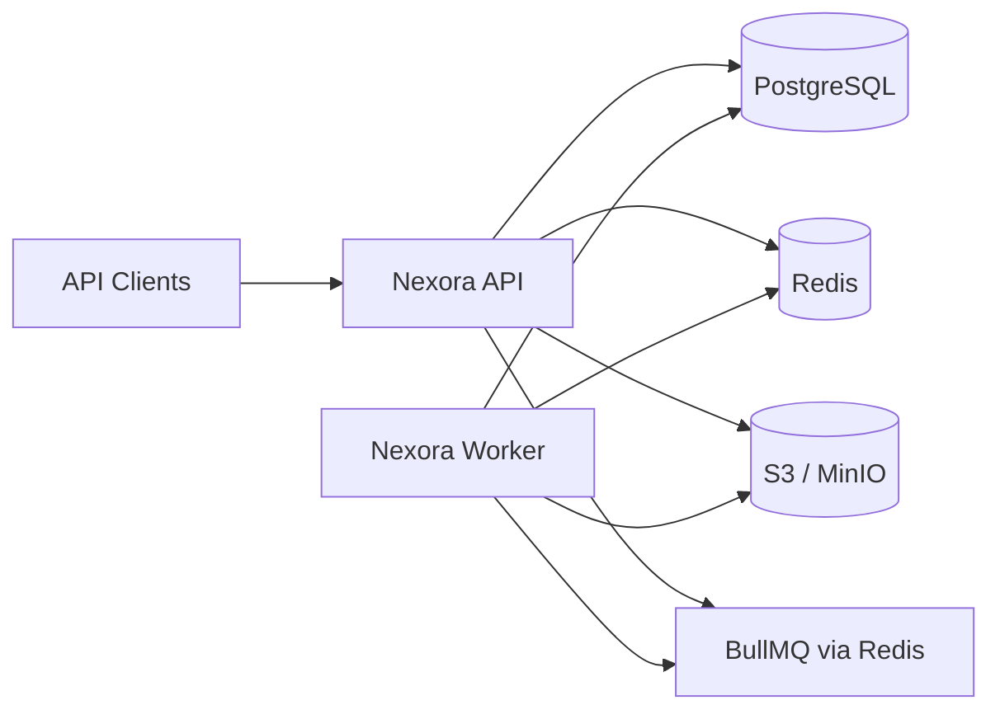

# Architecture Overview

Nexora Backend is a **modular monolith**: one deployable unit with strict internal module boundaries that can be extracted into services later if justified.

Phase 1 implements the **platform layer** — everything business modules will plug into — without implementing business modules themselves.

## System context



| Component                                  | Role                                                               |
| ------------------------------------------ | ------------------------------------------------------------------ |
| **API process** (`src/app/main.ts`)        | HTTP server, readiness probes, metrics, outbox publisher lifecycle |
| **Worker process** (`src/workers/main.ts`) | BullMQ job handlers, inbox consumer                                |
| **PostgreSQL**                             | System of record — business data, outbox, inbox, idempotency       |
| **Redis**                                  | Cache, locks, rate limits, BullMQ backing store                    |
| **S3 / MinIO**                             | Binary assets, exports, file uploads                               |

## Internal layering

```
┌─────────────────────────────────────────────┐
│  app/          HTTP, config, bootstrap      │
├─────────────────────────────────────────────┤
│  modules/*/    Business logic (Phase 2+)    │
│    domain/       Pure business rules        │
│    application/  Use cases                  │
│    infrastructure/ Module-specific adapters │
│    presentation/ HTTP route handlers        │
├─────────────────────────────────────────────┤
│  infrastructure/ Shared adapters            │
│    postgres, redis, queue, storage, …       │
├─────────────────────────────────────────────┤
│  shared/       Ports & utilities (no I/O)   │
└─────────────────────────────────────────────┘
```

**Dependency rule:** dependencies point inward. `shared/` is a leaf. `infrastructure/` implements `shared/` ports and must not depend on `modules/` or `app/`.

## Request lifecycle (HTTP)

1. **Helmet** and optional **CORS** applied globally.
2. **Request context** plugin assigns or trusts `X-Request-Id`, prepares correlation fields.
3. **Logging** plugin records request start/finish with redaction.
4. **Metrics** plugin records latency histograms (when enabled).
5. Route handler runs with Zod-validated input.
6. **Error handler** maps `AppError` and unknown errors to the standard envelope.

Foundation routes live at `/api/v1/foundation/*`. Health at `/health/*`. Metrics at `/metrics` when enabled.

## Background processing

1. Domain code (future) writes business change + outbox row in one transaction.
2. **OutboxPublisher** polls unpublished rows, enqueues `integration-events` jobs.
3. **Worker** receives job, **InboxConsumer** claims `(consumer, event_id)`, runs handler.
4. Duplicate delivery hits primary key conflict on `inbox_messages` — handler skipped.

Delivery semantics: **at-least-once**. Handlers must be idempotent; inbox provides deduplication.

## Configuration

All environment variables are declared in `src/app/config/schema.ts` and parsed once at startup. No other file reads `process.env` directly.

## Multi-tenancy (foundation)

Migration `0001` creates `app.current_tenant_id()`, reading a transaction-local GUC set by the application. RLS policies on future domain tables will reference this function. Phase 1 does not yet set tenant context on every request — that arrives with auth in a later phase.

## API surfaces

| Prefix                         | Purpose                            | Phase                               |
| ------------------------------ | ---------------------------------- | ----------------------------------- |
| `/api/v1`                      | Native Nexora API                  | Phase 1 (foundation endpoints only) |
| `/api/v2`                      | ChannelEngine compatibility facade | Deferred                            |
| `/health`, `/metrics`, `/docs` | Operations                         | Phase 1                             |

See [api-strategy.md](api-strategy.md) for versioning details.

## Quality gates

| Gate         | Command              |
| ------------ | -------------------- |
| Types        | `npm run typecheck`  |
| Lint         | `npm run lint`       |
| Architecture | `npm run arch:check` |
| Unit tests   | `npm run test:unit`  |
| All above    | `npm run verify`     |

## Further reading

- [module-boundaries.md](module-boundaries.md) — enforceable rules
- [database.md](database.md) — schema and migrations
- [events.md](events.md) — outbox/inbox deep dive
- [decisions/README.md](../decisions/README.md) — ADR index
